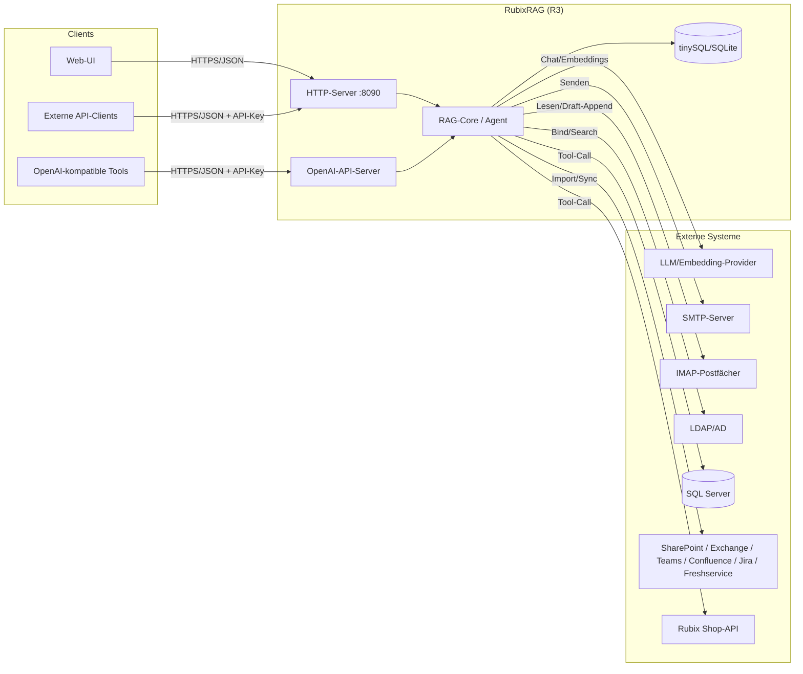

# RubixRAG (R3) – Schnittstellen-Übersicht

Dieser Ordner dokumentiert **jede Schnittstelle** des Tools – sowohl **eingehend**
(alles, was von außen in R3 hineinruft: HTTP-API, Uploads, Mail-Import, OpenAI-
kompatible API) als auch **ausgehend** (alles, was R3 selbst aufruft: lokale
Embeddings und Chat-Provider, SMTP, IMAP, LDAP, MSSQL, externe SaaS-
Connectoren, Storage-Backends).

Die LLM-Rollen sind bewusst getrennt: Embeddings laufen ausschließlich lokal
über das LM-Studio/OpenAI-kompatible Profil. Chat kann über `local`, `azure`,
`openai`, `openrouter`, `claude` oder `gemini` laufen. OpenAI/Azure/OpenRouter
nutzen Chat Completions; Claude nutzt die Messages API, Gemini
`GenerateContent`. Native Tool-Calls werden intern in RubixRAGs gemeinsames
Tool-Format übersetzt, SQL/HTTP/Shop-Ausführung bleibt vollständig in R3.

Zentrale Registrierungsstelle für fast alle HTTP-Routen: `registerRoutes` in
[handlers.go:55-274](../handlers.go), aufgerufen aus [main.go](../main.go).

## Methodik: Wie wir „Richtung“ beschreiben

Ein einzelnes Wort wie „eingehend“/„ausgehend“ oder „Push“/„Pull“ reicht nicht
aus, um eine Schnittstelle vollständig zu beschreiben – die Begriffe
beantworten unterschiedliche Fragen und lassen sich sogar widersprüchlich
kombinieren: Beim IMAP-Import zum Beispiel baut R3 die Verbindung *aktiv nach
außen* auf (R3 ist Client), holt dabei aber *Daten ab* statt welche zu senden
(Pull). Ein einziges Label kann das nicht eindeutig ausdrücken. Wir trennen
deshalb drei unabhängige Achsen:

1. **Verbindungsrolle** – wer baut die Netzwerkverbindung auf?
   `Server` = R3 horcht auf einem Port, eine Gegenstelle verbindet sich zu R3.
   `Client` = R3 verbindet sich aktiv nach außen. `n/a` = kein Netzwerk beteiligt
   (rein lokaler/dateibasierter Zugriff, z. B. Storage-Backend).
2. **Datenfluss** – wohin bewegt sich die eigentliche Nutzlast, unabhängig
   davon, wer die Verbindung aufgebaut hat? `Push` = die initiierende Seite
   schreibt/sendet die Nutzlast, die Antwort ist nur eine Bestätigung (z. B.
   SMTP-Versand, IMAP-`APPEND`). `Pull` = die initiierende Seite schickt nur
   eine kleine Anfrage, die eigentliche Nutzlast kommt zurück (z. B.
   IMAP-Fetch, LDAP-Suche, `GET`-Endpunkte). `Request/Response` = beide
   Richtungen tragen relevante Nutzlast in derselben Interaktion (z. B.
   Chat-Frage + generierte Antwort, Formular-Speichern + aktualisierter Stand).
3. **Aktor/Trigger** – wer/was löst die Aktion fachlich aus: Mensch, Admin,
   Scheduler oder System (siehe eigene Spalte in den Tabellen unten).

Diese drei Achsen sind unabhängig voneinander und werden deshalb getrennt
angegeben statt in einem einzigen „Richtung“-Wort vermischt zu werden.
Zusammengesetzte Schnittstellen (z. B. [import-connectors.md](import-connectors.md),
[mail-draft-workflow.md](mail-draft-workflow.md), [connection-tests.md](connection-tests.md),
[auth-ldap-login.md](auth-ldap-login.md)) bestehen aus zwei Beinen – einer
HTTP-Trigger-Seite (R3 = Server) und einer externen Abruf-/Sende-Seite
(R3 = Client) – und werden entsprechend mit beiden Rollen ausgewiesen
(Notation `Server→Client`).

## Eingehend (Incoming)

### Kern-RAG / Chat
| Datei | Schnittstelle | Verbindungsrolle | Datenfluss | Typischer Aktor/Trigger |
|---|---|---|---|---|
| [chat-ask.md](chat-ask.md) | `POST /api/ask` – Frage stellen, NDJSON-Streaming-Antwort | Server | Request/Response | Mensch (Chat-Nutzer über Web-UI oder API-Client) |
| [search.md](search.md) | `POST /api/search` – reine Retrieval-Suche ohne LLM-Antwort | Server | Pull | Mensch/System (API-Client, eigenes Frontend) |
| [chat-history.md](chat-history.md) | `/api/chat/conversations/*` – Server-seitige Chat-Historie | Server | gemischt (`GET`=Pull, `POST`=Push) | Mensch (eingeloggter Chat-Nutzer über Web-UI) |
| [sources-chunks.md](sources-chunks.md) | `/api/sources/*`, `/api/chunks` – Quellen- & Chunk-Verwaltung | Server | gemischt (Lesen=Pull, Schreiben/Löschen=Push) | Admin (Verwaltung); Mensch (Chat-Nutzer beim Anklicken von Zitaten) |
| [feedback.md](feedback.md) | `/api/feedback` – Daumen hoch/runter zu Antworten | Server | Push | Mensch (Chat-Nutzer über Web-UI) |
| [vision-attachments.md](vision-attachments.md) | Bild-Anhänge in `/api/ask` (Vision/OCR-Routing) | Server (Teil derselben Verbindung wie `/api/ask`) | Push | Mensch (Chat-Nutzer, hängt Bild an Frage an) |
| [voice-transcription.md](voice-transcription.md) | `POST /api/voice/transcribe` – lokale Whisper-Transkription | Server + lokaler CLI-Prozess | Push/Response | Mensch (Chat-Nutzer per Push-to-talk) |

### Upload & Import
| Datei | Schnittstelle | Verbindungsrolle | Datenfluss | Typischer Aktor/Trigger |
|---|---|---|---|---|
| [file-upload.md](file-upload.md) | `POST /api/upload` – Datei-Upload (Multipart) | Server | Push | Admin (manueller Upload über Web-UI) |
| [import-connectors.md](import-connectors.md) | PST, SharePoint, Exchange Online, IMAP, Teams, Confluence, Jira, Freshservice, Web/RSS Import | Server→Client (zwei Beine, siehe Methodik oben) | Trigger=Push/Request-Response, Abruf=Pull | Admin (manuell angestoßen) **oder** Scheduler (periodischer Sync-Job) |

### Mail-Workflow (Human-in-the-loop)
| Datei | Schnittstelle | Verbindungsrolle | Datenfluss | Typischer Aktor/Trigger |
|---|---|---|---|---|
| [mail-draft-workflow.md](mail-draft-workflow.md) | `/api/draft/*`, `/api/chat/email` – Antwortentwürfe, IMAP-Draft-Save, `.eml`-Export, Mail-Versand | Server→Client (HTTP-Seite Server, SMTP/IMAP-Seite Client) | gemischt – siehe Datei (Fetch=Pull, Versand/Append=Push) | Scheduler (stößt Entwurfserzeugung bei neuer Mail an) → Mensch (Admin prüft/bearbeitet/versendet) |

### Administration
| Datei | Schnittstelle | Verbindungsrolle | Datenfluss | Typischer Aktor/Trigger |
|---|---|---|---|---|
| [settings-admin.md](settings-admin.md) | `/api/settings*` – Konfiguration lesen/schreiben | Server | gemischt (`GET`=Pull, `POST`=Push) | Admin (Web-UI) |
| [connection-tests.md](connection-tests.md) | `/api/settings/test/*` – Verbindungstests für alle Connectoren | Server→Client (Trigger per HTTP, Test-Verbindung als Client) | Request/Response | Admin (manueller Test beim Konfigurieren) |
| [scheduler-admin.md](scheduler-admin.md) | `/api/scheduler/*` – Import-Scheduler-Dashboard | Server | gemischt (Status=Pull, run/cancel/pause=Push) | Admin (Beobachtung/Steuerung); Scheduler selbst (interner Hintergrundprozess) |
| [admin-notifications.md](admin-notifications.md) | `/api/admin/notifications*` – Live-Benachrichtigungsfeed (SSE) | Server | gemischt (Einmal-Poll=Pull, `/stream`=Server-Push) | System (Scheduler-Job löst Benachrichtigung aus) → Admin (empfängt Toast) |
| [apikeys.md](apikeys.md) | `/api/apikeys*` – API-Key-Verwaltung | Server | gemischt (Liste=Pull, erzeugen/widerrufen=Push) | Admin (Web-UI) |
| [agent-audit.md](agent-audit.md) | `/api/agent/audit` – Tool-Aufruf-Protokoll des Agenten | Server | Pull | Admin (Einsicht/Compliance); Einträge selbst stammen vom Agenten (automatisch, ausgelöst durch Chat-Nutzer) |
| [storage-stats.md](storage-stats.md) | `/api/admin/storage` – Speicher-Statistiken | Server | Pull | Admin (Web-UI) |
| [prompts-skills-admin.md](prompts-skills-admin.md) | `/api/prompts*`, `/api/skill*` – Prompt-/Skill-Verwaltung | Server | gemischt (Lesen=Pull, Schreiben/Löschen=Push) | Admin (Web-UI) |
| [department-rules.md](department-rules.md) | `/api/department-rules*` – Abteilungs-/Zugriffsregeln | Server | gemischt (Lesen=Pull, save/reset=Push) | Admin (Web-UI) |

### Auth & sonstige Endpunkte
| Datei | Schnittstelle | Verbindungsrolle | Datenfluss | Typischer Aktor/Trigger |
|---|---|---|---|---|
| [auth-ldap-login.md](auth-ldap-login.md) | `/api/auth/*` – Login/Logout/Status (LDAP + Session) | Server→Client (HTTP-Login Server, LDAP-Bind Client) | Request/Response (→ Pull beim LDAP-Bein) | Mensch (jeder Nutzer beim Anmelden) |
| [openai-compatible-api.md](openai-compatible-api.md) | `/v1/chat/completions`, `/v1/models` – eigener OpenAI-kompatibler Server | Server | Request/Response (`/models`=Pull) | System (Drittwerkzeug/Skript mit OpenAI-Client) |
| [static-ui-docs.md](static-ui-docs.md) | `/`, `/app.js`, `/api/docs`, `/healthz` – UI & Dokumentation | Server | Pull | Mensch (Browser); System (Monitoring/Health-Check bei `/healthz`) |

## Ausgehend (Outgoing)

| Datei | Schnittstelle | Verbindungsrolle | Datenfluss | Ausgelöst durch |
|---|---|---|---|---|
| [llm-embedding-provider.md](llm-embedding-provider.md) | Lokale Embeddings (LM Studio) sowie Chat-Aufrufe an local/Azure/OpenAI/OpenRouter/Claude/Gemini | Client | Request/Response (OpenAI-kompatibel; Claude/Gemini nativ) | System (RAG-Core, angestoßen durch Mensch via `/api/ask` oder durch Import-Connectoren/Scheduler beim Einbetten neuer Chunks) |
| [storage-backend.md](storage-backend.md) | tinySQL / SQLite Vektor- & Chat-Storage | n/a (kein Netzwerk, in-process/dateibasiert) | gemischt (Lesen=Pull, Schreiben=Push) | System (jede Lese-/Schreiboperation der RAG-Core, letztlich durch Mensch oder Scheduler ausgelöst) |
| [mssql-tool.md](mssql-tool.md) | Live-Abfragen gegen SQL Server (Agent-Tool) | Client | Pull (nur `SELECT` erlaubt) | System (Agent während `/api/ask`), angestoßen durch Mensch (Chat-Frage) |
| [http-query-tool.md](http-query-tool.md) | Generische HTTP-Abfragevorlagen/REST-Connectoren (Agent-Tool) | Client | Pull (nur `GET` erlaubt) | System (Agent während `/api/ask`), angestoßen durch Mensch (Chat-Frage) |
| [shop-connector.md](shop-connector.md) | Rubix-Shop-API (B2B-Backend) | Client | Pull | System (Agent während `/api/ask`), angestoßen durch Mensch (Chat-Frage) |
| [ldap-directory-outgoing.md](ldap-directory-outgoing.md) | LDAP/Active-Directory-Bind & -Suche | Client | Pull | Mensch (Login-Vorgang) |

## Gesamtüberblick (Mermaid)

## Technische Rahmenbedingungen (Kurzreferenz)

Vollständigkeits-Check durchgeführt (Stand 2026-07-14): alle in `handlers.go`
registrierten Routen, alle `ListenAndServe`-Aufrufe, alle ausgehenden
Netzwerk-/Prozessaufrufe (`http.Client`, `net.Dial`, `smtp.`, `sql.Open`,
`exec.Command`) und die `external/`-Unterordner wurden gegen diese Dokumentation
abgeglichen. Ergebnis: keine fehlenden HTTP-Routen, kein pprof-/Metrics-/gRPC-/
Unix-Socket-Endpunkt, `external/*` ist reines Scratch-Material ohne
Produktionscode (siehe [AGENTS.md](../AGENTS.md)). Ergänzungen aus einem
zweiten Detail-Durchgang: der `markitdown`-Subprozessaufruf in `extract.go`
(→ [file-upload.md](file-upload.md)), Session-Cookie-Attribute (signiert,
`HttpOnly`, `SameSite=Strict`, bewusst kein `Secure` – siehe
[auth-ldap-login.md](auth-ldap-login.md)), API-Key-Hashing (SHA-256, kein
Klartext in `settings.json` – siehe [apikeys.md](apikeys.md)), der
Scheduler-Mechanismus (30s-Ticker statt OS-Cron – siehe
[scheduler-admin.md](scheduler-admin.md)), Speicherorte von Feedback-/Audit-Log
(JSONL neben `settings.json`, siehe [feedback.md](feedback.md)/[agent-audit.md](agent-audit.md)),
die vollständige CLI-Flag-Tabelle in [settings-admin.md](settings-admin.md) sowie
ein sicherheitsrelevanter Fund: das **Break-Glass-Admin-Passwort**
(`settings.AdminPasswordEnv`), das `/api/auth/login` vor jedem LDAP-Bind prüft
und bei Übereinstimmung eine vollwertige Admin-Session ohne LDAP-Kontakt
ausstellt – zu unterscheiden vom rein kosmetischen UI-Gate `/api/admin/check`
(siehe [auth-ldap-login.md](auth-ldap-login.md)).

Die Kurzreferenz-Tabelle unten wurde zusätzlich gegen alle 25 Einzeldokumente
in diesem Ordner abgeglichen: jede dort beschriebene Schnittstelle hat nun eine
eigene Zeile (bzw. teilt sich eine Zeile mit einer protokoll-/paketgleichen
Schnittstelle, z. B. Confluence/Jira mit identischem Basic-Auth-REST-Muster).

| Schnittstelle | Verbindungsrolle | Datenfluss | Protokoll | Port/Adresse | TLS/Auth | Timeouts/Limits | Package/Bibliothek |
|---|---|---|---|---|---|---|---|
| Haupt-HTTP-Server | Server | Request/Response | HTTP/1.1 | `-addr`, Default `:8090` | kein TLS im Prozess; Session-Cookie/API-Key | keine Read/Write-Timeouts; Login-Limiter 10/5min pro IP | [`net/http`](https://pkg.go.dev/net/http) (Stdlib) |
| OpenAI-kompatibler Server | Server | Request/Response | HTTP/1.1 + SSE | `settings.OpenAIAPI.Port`, kein Default, standardmäßig aus | kein TLS im Prozess; API-Key (Bearer) | 5s Graceful-Shutdown | [`net/http`](https://pkg.go.dev/net/http) (Stdlib) |
| SMTP (ausgehend) | Client | Push | `net/smtp` | Default Port 25 | STARTTLS automatisch verhandelt; PlainAuth optional | kein explizites Timeout | [`net/smtp`](https://pkg.go.dev/net/smtp) (Stdlib) |
| IMAP (ausgehend) | Client | Pull (Fetch) / Push (Draft-`APPEND`) | `go-imap/v2` | Default Port 993 | implizites TLS (`DialTLS`) oder unverschlüsselt, je `UseTLS` | kein explizites Timeout; neue Verbindung je Poll | [`github.com/emersion/go-imap/v2`](https://github.com/emersion/go-imap) |
| LDAP (ausgehend) | Client | Pull | `go-ldap/v3` | laut `cfg.URL` (389/636) | LDAPS via eingebettete interne CA-Chain | kein explizites Timeout; Login-Limiter 10/5min | [`github.com/go-ldap/ldap/v3`](https://github.com/go-ldap/ldap) |
| MSSQL (ausgehend) | Client | Pull (nur `SELECT`) | TDS (`database/sql`) | Default Port 1433 | `TrustServerCertificate`-Option, DSN-Auth | `MaxRows`/`TimeoutSeconds` konfigurierbar; nur `SELECT` erlaubt | [`github.com/microsoft/go-mssqldb`](https://github.com/microsoft/go-mssqldb) + [`database/sql`](https://pkg.go.dev/database/sql) |
| LLM/Embedding-Provider | Client | Request/Response | HTTP/JSON; SSE bei OpenAI-kompatiblem Chat | Embeddings lokal Default `http://localhost:1234`; Chat zusätzlich Azure, OpenAI, OpenRouter, Claude, Gemini | Bearer (OpenAI-kompatibel), `api-key` (Azure), `x-api-key` (Claude), `x-goog-api-key` (Gemini) | Client-Timeout 120s; Retry bei Netzwerk/429/5xx | [`net/http`](https://pkg.go.dev/net/http) (eigener Client, kein SDK) |
| Rubix-Shop-API | Client | Pull | HTTPS/JSON | Default `https://de.rubix.com` | Token-Auth | Timeout 10s, Connection-Pool | [`net/http`](https://pkg.go.dev/net/http) (Stdlib) |
| Storage tinySQL | n/a (kein Netzwerk) | gemischt (Lesen=Pull, Schreiben=Push) | in-process/dateibasiert | Verzeichnis `r3-data/` | n/a | Speicherlimit 256MB Default (index/hybrid) | [`github.com/SimonWaldherr/tinySQL`](https://github.com/SimonWaldherr/tinySQL) |
| Storage SQLite | n/a (kein Netzwerk) | gemischt (Lesen=Pull, Schreiben=Push) | in-process/dateibasiert | Einzeldatei `r3-data.db` | n/a | `busy_timeout=5000ms` | [`modernc.org/sqlite`](https://pkg.go.dev/modernc.org/sqlite) |
| PST-Import (ausgehend) | n/a (kein Netzwerk, Datei-Parsing) | Pull | Datei-Parsing | lokale/Netzlaufwerk-`.pst`-Datei | n/a | Formulargrößen-Limit 2 GB | [`github.com/mooijtech/go-pst/v6`](https://github.com/mooijtech/go-pst) |
| Microsoft Graph (SharePoint/Exchange/Teams) | Client | Pull | HTTPS/JSON, OAuth2 Client-Credentials | `graph.microsoft.com` / `login.microsoftonline.com` | OAuth2-Access-Token | siehe [import-connectors.md](import-connectors.md) | [`net/http`](https://pkg.go.dev/net/http) (eigene Graph-Implementierung, kein SDK) |
| Confluence (ausgehend, Import) | Client | Pull | HTTPS/JSON (Atlassian Cloud REST) | konfigurierbare Basis-URL | Basic-Auth (E-Mail + API-Token) | siehe [import-connectors.md](import-connectors.md) | [`net/http`](https://pkg.go.dev/net/http) (eigener REST-Client, kein SDK) |
| Jira (ausgehend, Import) | Client | Pull | HTTPS/JSON (Atlassian Cloud REST) | konfigurierbare Basis-URL | Basic-Auth (E-Mail + API-Token) | siehe [import-connectors.md](import-connectors.md) | [`net/http`](https://pkg.go.dev/net/http) (eigener REST-Client, kein SDK) |
| Freshservice (ausgehend, Import) | Client | Pull | HTTPS/JSON | `https://api.<domain>.freshservice.com/api/v2/` | Basic-Auth mit API-Key | siehe [import-connectors.md](import-connectors.md) | [`net/http`](https://pkg.go.dev/net/http) (eigener REST-Client, kein SDK) |
| Web/RSS-Import (ausgehend) | Client | Pull | HTTP(S), RSS/Atom | beliebige URL/Feed | keine (öffentlicher Abruf) | siehe [import-connectors.md](import-connectors.md) | [`net/http`](https://pkg.go.dev/net/http) (Stdlib) |
| Generischer REST-Connector (ausgehend, Live-Tool) | Client | Pull (nur `GET`) | HTTPS/JSON | admin-konfigurierte `base_url` je Connector | `none`\|Basic\|Bearer\|benannter Header, SSRF-Host-Guard | siehe [http-query-tool.md](http-query-tool.md) | [`net/http`](https://pkg.go.dev/net/http) (Stdlib) |
| `fetch_url`-Agent-Tool (ausgehend, opt-in `agent.allow_web_fetch`) | Client | Pull | HTTP(S) | öffentliche URLs; private/interne Adressen zusätzlich nur wenn `import.allow_internal_fetch=true` (Loopback/Link-lokal bleiben immer blockiert) | keine | siehe [agent-audit.md](agent-audit.md) | [`net/http`](https://pkg.go.dev/net/http) (Stdlib) |
| `web_search`-Agent-Tool (ausgehend, opt-in `agent.allow_web_search`) | Client | Pull | HTTPS\JSON | `https://api.tavily.com/search` (fest, `websearch.go`) | `Authorization: Bearer` mit admin-konfiguriertem Tavily-API-Key | siehe [agent-audit.md](agent-audit.md) | [`net/http`](https://pkg.go.dev/net/http) (Stdlib) |
| `azure_bing_search`-Agent-Tool (ausgehend, opt-in `agent.allow_azure_bing_search`) | Client | Pull | HTTPS\JSON | Azure-OpenAI-Ressource des `azure`-LLM-Profils, Pfad `/openai/v1/responses` (`azurebingsearch.go`) — Suche selbst läuft serverseitig bei Microsoft (Grounding with Bing Search), nicht direkt vom R3-Server aus | `api-key`-Header mit dem `azure`-Profil-Schlüssel (kein separater Key) | siehe [agent-audit.md](agent-audit.md) | [`net/http`](https://pkg.go.dev/net/http) (Stdlib) |
| Chat-History-Storage | n/a (kein Netzwerk) | gemischt (Lesen=Pull, Schreiben=Push) | in-process/dateibasiert | eigene SQLite-Datei, getrennt von `r3-data.db` ([chathistory.go:46](../chathistory.go)) | n/a | nur aktiv wenn `enable_chat_history=true` | [`modernc.org/sqlite`](https://pkg.go.dev/modernc.org/sqlite) |
| `markitdown`/`tesseract` (Subprozess) | n/a (lokaler Prozessaufruf, kein Netzwerk) | Push (Datei rein) / Pull (Text zurück) | lokaler Prozessaufruf | n/a | nur bei `allow_shell_exec=true` | 120s bzw. 60s Timeout | [`os/exec`](https://pkg.go.dev/os/exec) (Stdlib) |
| Session-Cookie | Server (Teil des Haupt-HTTP-Servers) | Push (Cookie wird gesetzt) | signierter Base64-Payload + HMAC | Cookie | `HttpOnly`, `SameSite=Strict`, kein `Secure` (bewusst, s.o.) | `MaxAge` = `sessionTTL` | [`net/http`](https://pkg.go.dev/net/http), [`crypto/hmac`](https://pkg.go.dev/crypto/hmac) (Stdlib) |
| API-Keys | Server (Teil des Haupt-HTTP-Servers) | gemischt (Liste=Pull, erzeugen/widerrufen=Push) | n/a | n/a | SHA-256-Hash in `settings.json`, kein Klartext gespeichert | – | [`crypto/sha256`](https://pkg.go.dev/crypto/sha256) (Stdlib) |
| Break-Glass-Admin-Login | Server (Teil von `/api/auth/login`) | Request/Response | HTTP/JSON | n/a | konstantzeit-Vergleich gegen `AdminPasswordEnv` | teilt Login-Limiter (10/5min) | [`crypto/subtle`](https://pkg.go.dev/crypto/subtle) (Stdlib) |
| Scheduler | n/a (kein Netzwerk, interner Ticker) | Push (löst Connector-Aufrufe aus) | in-process Ticker | n/a | n/a | 30s Tick-Intervall, je Connector eigener `PollInterval` | [`time`](https://pkg.go.dev/time) (Stdlib) |
| Feedback-/Audit-Log | n/a (kein Netzwerk) | Push (Append-only Schreiben) | append-only JSONL-Datei | Datei neben `settings.json` (`r3-feedback.jsonl`/`r3-audit.jsonl`) | n/a | keine automatische Retention/Bereinigung | [`encoding/json`](https://pkg.go.dev/encoding/json), [`os`](https://pkg.go.dev/os) (Stdlib) |
| Datei-Upload (Multipart) | Server | Push | HTTP/1.1 Multipart, Teil des Haupt-HTTP-Servers | `POST /api/upload` | `requireAdminSession` | 200 MB Formulargröße; PST-Import 2 GB | [`net/http`](https://pkg.go.dev/net/http), [`mime/multipart`](https://pkg.go.dev/mime/multipart) (Stdlib) |
