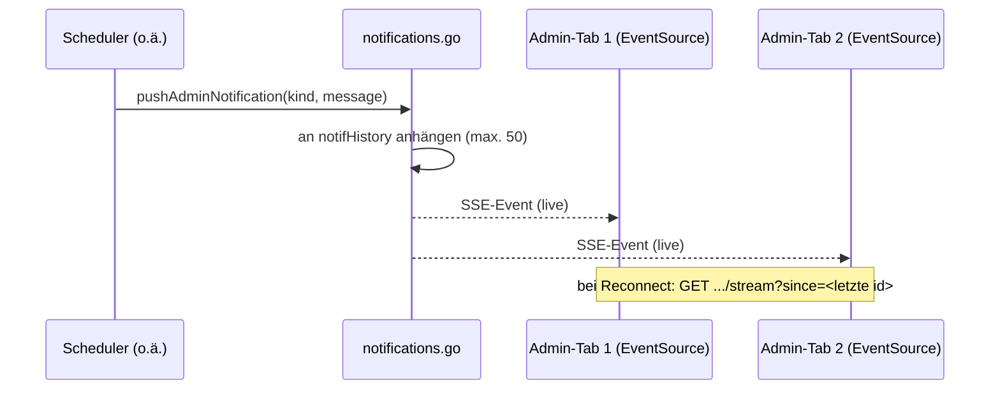

# Admin-Benachrichtigungen (`/api/admin/notifications*`)

**Verbindungsrolle:** Server
**Datenfluss:** gemischt – `/api/admin/notifications` ist Pull (einmaliger
Snapshot), `/api/admin/notifications/stream` ist ein lang laufender
Server-→Client-Push über SSE
**Schutz:** `requireAdminSession`
**Registrierung:** [handlers.go:130-131](../handlers.go)
**Implementierung:** [notifications.go](../notifications.go)

## Zweck

Zeigt jedem eingeloggten Admin – egal welcher Tab gerade offen ist – als
`novapop.js`-Toast an, wenn im Hintergrund etwas Meldenswertes passiert
(z. B. „Import X fertig"), ausgelöst von `pushAdminNotification`
([notifications.go:52](../notifications.go)), aktuell aus dem Scheduler
(`scheduler.go`) bei Job-Abschluss.

Ursprünglich ein reines 8-Sekunden-Polling jeder offenen Admin-Registerkarte
gegen `GET /api/admin/notifications` – harmlos bei kleiner Nutzerzahl, aber
unnötig geschwätzig im Access-Log und mit eigenem Request/Response/JSON-
Roundtrip für den (meist) leeren Fall. Die SSE-Variante hält stattdessen
eine langlebige Verbindung je Tab, in die der Server nur schreibt, wenn
tatsächlich etwas passiert.

## Endpunkte

| Pfad | Zweck |
|---|---|
| `GET /api/admin/notifications?since=<id>` | einmaliger Snapshot aller Benachrichtigungen mit `id > since` (Default `since=0`) – `handleAdminNotifications` |
| `GET /api/admin/notifications/stream?since=<id>` | Server-Sent-Events-Stream: erst Nachhol-Snapshot ab `since`, danach jede neue Benachrichtigung live, solange die Verbindung offen bleibt – `handleAdminNotificationsStream` |

`handleAdminNotifications` (der ursprüngliche Einmal-Poll) bleibt
registriert für Aufrufer, die bewusst nur einen Zeitpunkt-Snapshot wollen
(Skript, künftige Nicht-Browser-Integration) – beide Endpunkte teilen sich
dieselbe In-Memory-Historie (`notifHistory`, auf `notifHistoryLimit = 50`
Einträge begrenzt, kein Neustart-übergreifendes Persistieren – bei einem
Neustart gehen anstehende Benachrichtigungen verloren, genau wie Sessions).

## Datenmodell

```jsonc
{ "id": 42, "kind": "import_ok", "message": "Import SharePoint fertig: 12 Dateien", "at": 1752670000 }
```

`Kind` steuert clientseitig den Toast-Stil: ein `_error`-Suffix wird auf
novapop's `error`-Typ gemappt, alles andere auf `success`.

## Technische Details

- **SSE-Framing:** `id: <id>\ndata: <json>\n\n` pro Ereignis
  ([notifications.go:220](../notifications.go)); ein
  `: keepalive\n\n`-Kommentar alle **25 s**
  (`notifStreamKeepAlive`) auf einer ansonsten stillen Verbindung, damit ein
  Proxy/Load-Balancer mit eigenem Idle-Timeout (häufig 60 s) die Verbindung
  nicht als tot betrachtet
- **Reconnect/Catch-up:** `web/app.js`s `EventSource` reconnected
  automatisch bei Abbruch und übergibt die zuletzt gesehene ID selbst als
  `?since=`-Query-Parameter (kein `Last-Event-ID`-Header-Handling nötig)
- **Broadcast:** jeder aktive Subscriber bekommt einen gepufferten Channel
  (`notifSubscriber`, Puffer 8); ist der Puffer voll (langsamer/blockierter
  Reader), wird der Push für genau diesen einen Subscriber nicht-blockierend
  verworfen – der nächste Reconnect holt ihn über den `?since=`-Snapshot
  nach
- **Kein Persistieren:** rein in-process, kein JSONL/DB – anders als
  Feedback-/Audit-Log ([feedback.md](feedback.md), [agent-audit.md](agent-audit.md))



## Zusammenhänge

- Ausgelöst u. a. vom Scheduler: [scheduler-admin.md](scheduler-admin.md)
