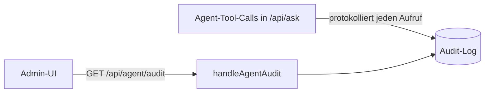

# Agent-Audit-Log (`/api/agent/audit`)

**Verbindungsrolle:** Server
**Datenfluss:** Pull (reiner Lesezugriff auf das Log)
**Schutz:** `requireAdminSession`
**Registrierung:** [handlers.go:105](../handlers.go)
**Implementierung:** `handleAgentAudit`, `audit.go`

## Zweck

Zeigt das Protokoll aller Tool-Aufrufe, die der RAG-Agent während
`/api/ask`-Anfragen ausgeführt hat (z. B. MSSQL-Abfragen, Shop-API-Aufrufe,
HTTP-Templates, `fetch_url`, `web_search`, `azure_bing_search`,
Sub-Agenten-Delegation) – wichtig für Nachvollziehbarkeit/Compliance, da der
Agent selbstständig externe Systeme anspricht.

## Sub-Agenten-Orchestrierung (`agent.go`)

Im `agent`-Tier (siehe [chat-ask.md](chat-ask.md)) stehen dem Modell zwei
Delegations-Werkzeuge zur Verfügung, deren Tool-Aufrufe **ebenfalls** im
Audit-Log landen:

- **`delegate_subtasks`** – zerlegt eine Anfrage in bis zu
  `agent.max_subtasks` (Default 4, Obergrenze 8, [agent.go:765](../agent.go))
  unabhängige Teilaufgaben, die als eigene, fokussierte Sub-Agenten
  **parallel** laufen (begrenzt durch `agent.max_concurrency`,
  `agentConcurrency`, [agent.go:782](../agent.go)) – jeweils mit eigenem
  Tool-Set (`buildSubAgentTools`) und eigener Runden-Obergrenze
  (`agent.max_subtask_rounds`, Default 4, Obergrenze 8). Ein
  Rekursionsschutz (`subAgentDepthKey`) verhindert, dass ein Sub-Agent
  seinerseits `delegate_subtasks` oder `web_research` aufruft.
- **`web_research`** – ein zielgerichteter, mehrstufiger Recherche-Sub-Agent
  mit eigenem `fetch_url`-artigen Werkzeug, das zusätzlich gefundene Links
  auflistet, damit der Sub-Agent selbst weiterverfolgen kann – separat vom
  Top-Level-`fetch_url` (das bewusst nie Links folgt).

Zwei weitere, einfachere (nicht-delegierende) externe Werkzeuge landen
ebenfalls im Audit-Log, sobald sie über die jeweilige Einstellung
freigeschaltet sind:

- **`web_search`** (`websearch.go`, `agent.allow_web_search`) – eine echte
  Stichwortsuche über die Tavily-API, liefert eine Trefferliste
  (Titel/Auszug/URL) statt Rohseiten.
- **`azure_bing_search`** (`azurebingsearch.go`,
  `agent.allow_azure_bing_search`) – beantwortet eine Frage direkt über
  Azure OpenAI's Responses-API-Werkzeug „Grounding with Bing Search" in
  einem Schritt (fertige, quellenbelegte Antwort statt Rohtreffer); nutzt
  das unter „LLM-Backend: Azure OpenAI" hinterlegte Deployment mit, kein
  separater Schlüssel.

**Attribution:** jeder Tool-Aufruf, den ein Sub-Agent ausführt, trägt im
Audit-Log ein zusätzliches `Agent`-Feld ([agent.go:112](../agent.go)) mit dem
Label des jeweiligen Sub-Agents (z. B. `"Web-Recherche: <Ziel>"`) statt leer
zu bleiben (leer = Top-Level-Agent) – so lässt sich im Log nachvollziehen,
**welcher** Teil-Agent welchen externen Aufruf gemacht hat, nicht nur dass
irgendein Tool lief. Dieselbe Attribution trägt inzwischen auch jeder
Eintrag im Debug-Modus-Werkzeug-Log (`debugToolCall.Agent`, [llm.go](../llm.go))
– dort vorher die einzige Stelle ohne Sub-Agenten-Zuordnung.

## Live-Timeline: Tool-Argumente/-Ergebnisse sichtbar, plus grafische Ansicht

Der Live-Schritt-Verlauf während einer laufenden `/api/ask`-Antwort
(`agentStep`, [llm.go:883](../llm.go), gerendert im Chat als
Schritt-Zeitleiste, `web/app.js`) zeigt zu jedem Tool-Aufruf zusätzlich zu
Tool-Name und Typ auch die (gekürzten) **Argumente** und das (gekürzte)
**Ergebnis** direkt in der laufenden Antwort an, statt nur "Tool X wurde
aufgerufen" ohne Inhalt – dieselbe Datensparsamkeit wie im persistierten
Audit-Log (kurze, strukturierte Ausschnitte, nie Zugangsdaten).

Jeder Schritt trägt zusätzlich eine prozessweit eindeutige `ID` sowie eine
`ParentID` (leer = oberste Ebene, sonst die ID des umschließenden
Sub-Agenten-/Werkzeug-Aufrufs) und einen Zeitstempel (`started_at_ms`) –
damit lässt sich aus dem Schritt-Strom eine echte Baumstruktur
rekonstruieren statt nur einer flachen, per Sub-Agenten-Label eingerückten
Liste. Ein Klick auf „🕸️ Grafisch“ neben der bisherigen „📋 Liste“-Ansicht
(`agentStepsPanel`, `web/app.js`) rendert genau diesen Baum live als
Mermaid-Flowchart (`buildStepGraphMermaid`/`renderAgentGraph`) – Knoten
zeigen Symbol, Werkzeug-/Agenten-Name, Status (⏳/✓/✗) und Dauer; eine
`#N`-Nummer verbindet jeden Knoten mit seiner vollständigen Zeile
(Argumente/Ergebnis) in der Listenansicht.

## Technische Details

- **Speicherung:** append-only JSONL-Datei neben `settings.json`, Default
  `r3-audit.jsonl` (`auditLogPath`, [audit.go:33-37](../audit.go)) – kein
  SQL-Table, keine automatische Bereinigung/Retention
- **Datensparsam:** Detail-Felder sind immer kurz/strukturiert (z. B.
  `source_id=…`, `connector=sharepoint chunks=12 errors=0`) – **nie** der
  volle Frage-/Antworttext und **nie** Zugangsdaten/Secrets ([audit.go:26-30](../audit.go))
- **Akteur:** die AD-Mail/CN der Session, sonst „anonym“ – nie ein Passwort

## Zusammenhänge

- Protokolliert Aufrufe der Tools aus [mssql-tool.md](mssql-tool.md),
  [shop-connector.md](shop-connector.md) sowie generischer HTTP-Templates
  (`http_tool.go`)
- Ausgelöst durch: [chat-ask.md](chat-ask.md)
