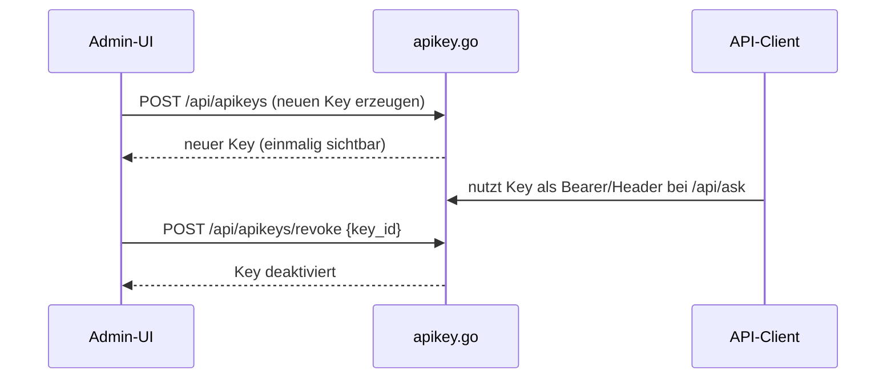

# API-Key-Verwaltung (`/api/apikeys*`)

**Verbindungsrolle:** Server
**Datenfluss:** gemischt – Liste abrufen ist Pull, Key erzeugen/widerrufen ist Push
**Schutz:** `requireAdminSession`
**Registrierung:** [handlers.go:129-130](../handlers.go)
**Implementierung:** `apikey.go`

## Endpunkte

| Pfad | Zweck |
|---|---|
| `/api/apikeys` | API-Keys auflisten/erzeugen |
| `/api/apikeys/revoke` | API-Key widerrufen |

## Zweck

Verwaltet die API-Keys, die für den Zugriff auf `/api/ask` und `/api/search`
via `requireAPIKey`-Middleware benötigt werden (siehe [chat-ask.md](chat-ask.md),
[search.md](search.md)) sowie ggf. für den OpenAI-kompatiblen Server
([openai-compatible-api.md](openai-compatible-api.md)).

## Technische Details

- **Speicherung:** Keys werden **nicht im Klartext** gespeichert – nur ein
  SHA-256-Hash landet in `settings.json` (`hashAPIKey`, [apikey.go:40-43](../apikey.go))
- **Erzeugung:** `generateAPIKey(name)` erzeugt den Klartext-Key einmalig
  (nur bei Erstellung sichtbar) und speichert `Hash: hashAPIKey(plaintext)`
  ([apikey.go:50-60](../apikey.go))
- **Prüfung:** eingehender Key wird gehasht und mit dem gespeicherten Hash
  verglichen ([apikey.go:74](../apikey.go))

