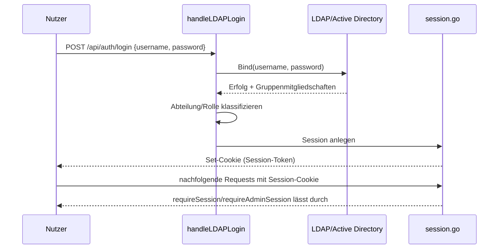

# Authentifizierung (`/api/auth/*`, `/api/admin/check`)

**Verbindungsrolle:** zweistufig – HTTP-Login: **Server**; LDAP-Bind/Suche: **Client** (siehe [ldap-directory-outgoing.md](ldap-directory-outgoing.md))
**Datenfluss:** Request/Response (Zugangsdaten rein, Session-Cookie raus); der interne LDAP-Aufruf ist **Pull** (Attribute/Gruppen abholen)
**Registrierung:** [handlers.go:196-199](../handlers.go)
**Implementierung:** `ldapauth.go`, `session.go`

## Endpunkte

| Methode | Pfad | Schutz | Zweck |
|---|---|---|---|
| GET | `/api/admin/check` | ungegated | reines UI-Sichtbarkeits-Gate über geteiltes Passwort – **kein Zugriffsschutz**, erzeugt keine Session ([handlers.go:1000-1028](../handlers.go)) |
| POST | `/api/auth/login` | ungegated | LDAP-Login **oder** Break-Glass-Passwort, erzeugt Session-Cookie |
| POST | `/api/auth/logout` | Session | Session beenden |
| GET | `/api/auth/status` | ungegated | aktuellen Auth-Status abfragen |

## Break-Glass-Admin-Passwort (Bypass für LDAP-Ausfälle)

`handleLDAPLogin` prüft **vor** jedem LDAP-Bind zuerst ein lokales
"Break-Glass"-Passwort aus der Umgebungsvariable `settings.AdminPasswordEnv`
(Default-Name `R3_ADMIN_PASSWORD`, [settings.go:120-138,1139](../settings.go)):
stimmt es überein (konstantzeit-Vergleich via `subtle.ConstantTimeCompare`,
[handlers.go:470-471](../handlers.go)), wird **sofort eine vollwertige
Admin-Session** ausgestellt – ganz ohne LDAP-Kontakt. Zweck: Admin-Zugriff
bleibt möglich, selbst wenn AD/LDAP down oder falsch konfiguriert ist; der
Check läuft bewusst zuerst, damit dieser Pfad nie an einer hängenden
LDAP-Verbindung wartet ([handlers.go:444-450](../handlers.go)).

Das ist ein **anderer** Mechanismus als `/api/admin/check` – letzteres ist
nur ein UI-Sichtbarkeits-Schalter ohne jede Session-/Zugriffswirkung
(„ein unkonfiguriertes Gate verhält sich, als gäbe es kein Gate“,
[handlers.go:1000-1004](../handlers.go)), während der Login-Bypass eine
echte, vollberechtigte Admin-Session erzeugt. Beide teilen sich denselben
Bruteforce-Limiter.

## Ablauf

## Technische Details

- **Bruteforce-Schutz:** 10 Fehlversuche / 5 Minuten pro Client-IP
  (`RemoteAddr`, kein Trust von `X-Forwarded-For`) – [ratelimit.go:22-24](../ratelimit.go)
- **Session-Cookie:** trägt nur eine zufällige Session-ID, signiert gegen
  Manipulation/Erraten, Format `<id>.<HMAC-Signatur>` (`signSession`),
  Cookie-Name `sessionCookieName`. Die eigentlichen `sessionClaims` (inkl.
  `Groups` = komplette AD-Gruppenmitgliedschaft und `Expires`) liegen
  serverseitig in `sessionStore`, nicht im Cookie selbst — vorher war der
  komplette Claims-Payload base64-codiert im Cookie-Wert, was bei Nutzern
  mit vielen AD-Gruppen das ~4096-Byte-Cookiegrößenlimit der Browser riss
  (`Set-Cookie` wurde dann stillschweigend verworfen: Login schien
  erfolgreich, jeder Folgerequest kam aber unauthentifiziert/401 an)
  ([session.go](../session.go))
- **Cookie-Attribute:** `HttpOnly: true`, `SameSite: Strict`, `MaxAge` = `sessionTTL`;
  **`Secure` bewusst nicht gesetzt** – R3 wird oft hinter Klartext-HTTP im internen
  Netz betrieben; TLS-Terminierung erfolgt ggf. an einem vorgelagerten Reverse-Proxy
  ([session.go:104-107](../session.go))

## Zusammenhänge

- Ausgehender LDAP-Aufruf im Detail: [ldap-directory-outgoing.md](ldap-directory-outgoing.md)
- Session schützt: [chat-history.md](chat-history.md), alle Admin-Endpunkte
- Gruppenmitgliedschaft steuert Abteilungs-Zugriff: [department-rules.md](department-rules.md)
