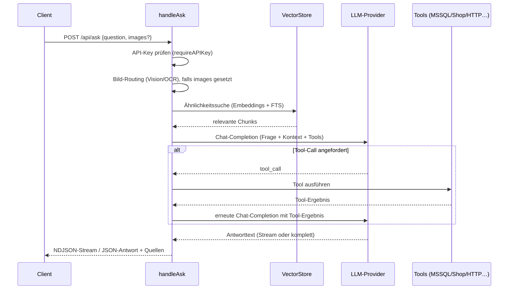

# `POST /api/ask` – Frage stellen (RAG-Chat)

**Verbindungsrolle:** Server (R3 nimmt die HTTP-Verbindung entgegen)
**Datenfluss:** Request/Response (Frage rein, Antwort/Stream raus – NDJSON-Streaming ist Response-seitig chunked, ändert nichts an der Rollenverteilung; siehe [README: Methodik](README.md#methodik-wie-wir-richtung-beschreiben))
**Schutz:** `requireAPIKey`
**Registrierung:** [handlers.go:127](../handlers.go)
**Implementierung:** `handleAsk`, [handlers.go:1312](../handlers.go)

## Zweck

Zentrale Frage-Antwort-Schnittstelle des RAG-Systems. Nimmt eine Nutzerfrage
(optional mit Bild-Anhängen, siehe [vision-attachments.md](vision-attachments.md)),
führt Retrieval gegen den Vektor-Store aus, ruft den konfigurierten LLM-Chat-Endpunkt
auf (ggf. mit Tool-Calling/Agentenschleife) und liefert die Antwort zurück – entweder
als einzelnes JSON-Objekt oder als NDJSON-Stream einzelner Tokens/Events.

## Request

```jsonc
{
  "question": "Wie beantrage ich Urlaub?",
  "images": [ { "data": "base64…", "mime": "image/png" } ],
  "profile": "local",
  "preset": "support-de",
  "tier": "standard"
}
```

Struct: `askRequest` ([handlers.go:1160](../handlers.go)), Bild-Feld
`askImageInput` ([chatimages.go:37-46](../chatimages.go)).

## Ausführungs-Tiers (`tier`, `tier.go`)

Ein ChatGPT-artiger "wie viel Maschinerie soll laufen"-Selektor, der das
frühere binäre `mode` ("" vs. `"agent"`) verallgemeinert – **ein**
Endpunkt (`/api/ask`), aber der Aufrufer wählt über `tier`, was mitläuft:

| Tier | Prompt-Basis | Live-Tools (MSSQL/Shop/HTTP) | Agent-Tools (Suche/Mail/`fetch_url`/`web_research`/`web_search`/`azure_bing_search`/Sub-Agenten) | Tool-Runden |
|---|---|---|---|---|
| `instant` | `index.md` | nein | nein | 0 – reiner RAG-Stream, kein Tool-Router-Preflight |
| `standard` (Default) | `index.md` | ja, **eine** Runde | nein | 1 |
| `agent` | `agent.md` | ja | ja | admin-konfiguriertes Maximum (`agentMaxRounds`) |

`resolveExecutionTier` ([tier.go:57](../tier.go)) ist eine reine Funktion
(kein I/O) und degradiert ein fehlendes/unbekanntes `tier` auf das alte
`mode`-Feld statt zu scheitern – jeder bestehende Aufrufer bleibt
unverändert kompatibel. Frontend-seitig lebt die Tier-Auswahl als
`#askTier`-Dropdown direkt im Chat-Tab (`web/templates/tab-chat.html`) –
der frühere, separate "Agent"-Tab wurde in diesen Selektor
zusammengeführt (`web/app.js`); es gibt keine getrennten Endpunkte/Historie
mehr für "Agent" gegenüber "Chat", nur noch dieselbe `/api/ask`-Anfrage mit
einem anderen `tier`-Wert.

## Response

- **Streaming (Standard):** `Content-Type: application/x-ndjson`, eine JSON-Zeile
  pro Chunk (Text-Token, Tool-Call-Event, Quellen, Abschluss-Event). Wird über
  `http.Flusher` sofort ausgeliefert.
- **Gepuffert:** wenn `settings.DisableStreaming == true`, wird stattdessen ein
  einzelnes JSON-Antwortobjekt zurückgegeben (Antworttext + Quellenliste).

## Technische Details

- **Rate-Limiting:** optionaler Sliding-Window-Limiter je API-Key
  ([ratelimit.go:98-128](../ratelimit.go)), **standardmäßig deaktiviert**
  (`limit<=0`)
- **Server-Timeouts:** der Haupt-HTTP-Server setzt keine `ReadTimeout`/
  `WriteTimeout` – lang laufende Streams werden dadurch nicht künstlich
  gekappt (siehe [static-ui-docs.md](static-ui-docs.md))

## Ablauf



## Zusammenhänge

- Bild-Verarbeitung: [vision-attachments.md](vision-attachments.md)
- LLM-Aufruf: [llm-embedding-provider.md](llm-embedding-provider.md)
- Vektor-Suche/Storage: [storage-backend.md](storage-backend.md)
- Agenten-Tools (MSSQL, Shop, HTTP-Templates): [mssql-tool.md](mssql-tool.md), [shop-connector.md](shop-connector.md)
- Presets: `GET /api/presets` ([handlers.go:126](../handlers.go), `preset.go`)
