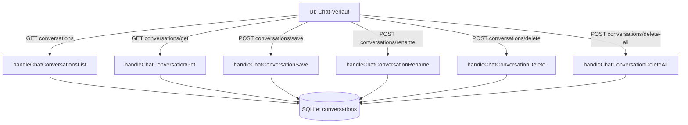

# Chat-Historie (`/api/chat/conversations/*`)

**Verbindungsrolle:** Server
**Datenfluss:** gemischt – `GET`-Routen sind Pull (Liste/Inhalt abrufen), `POST`-Routen sind Push (Konversation schreiben/löschen)
**Schutz:** `requireSession` (alle Routen)
**Registrierung:** [handlers.go:205-210](../handlers.go)
**Implementierung:** `chathistory.go`
**Storage:** eigene SQLite-Datenbank, Tabelle `conversations` ([chathistory.go:46](../chathistory.go))

## Endpunkte

| Methode | Pfad | Zweck |
|---|---|---|
| GET | `/api/chat/conversations` | Liste aller gespeicherten Konversationen des Nutzers |
| GET | `/api/chat/conversations/get` | Einzelne Konversation inkl. Nachrichten laden |
| POST | `/api/chat/conversations/save` | Konversation (neu oder aktualisiert) speichern |
| POST | `/api/chat/conversations/rename` | Titel einer Konversation ändern |
| POST | `/api/chat/conversations/delete` | Einzelne Konversation löschen |
| POST | `/api/chat/conversations/delete-all` | Alle Konversationen des Nutzers löschen |

Aktiviert über `settings.EnableChatHistory` / `settings.ChatHistoryPath`.

## Ablauf

## Zusammenhänge

- Unabhängig vom Haupt-Vektor-Store, eigene DB-Datei (siehe
  [storage-backend.md](storage-backend.md))
- Session-Gate: [auth-ldap-login.md](auth-ldap-login.md)
