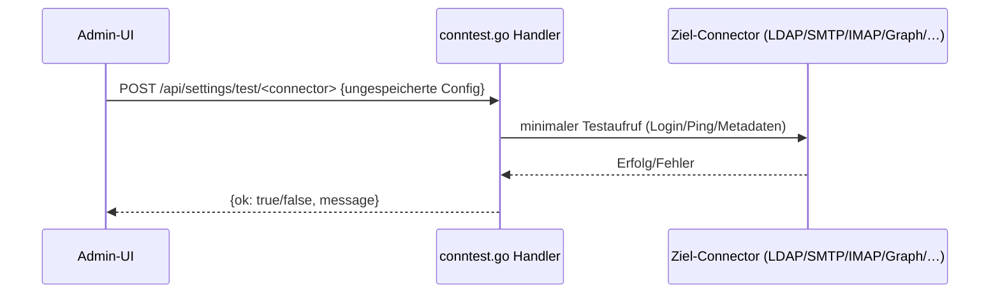

# Verbindungstests (`/api/settings/test/*`)

**Verbindungsrolle:** zweistufig – Trigger-seitig **Server** (Admin-UI ruft R3 auf), Test-seitig **Client** (R3 verbindet sich testweise zum jeweiligen Ziel-System)
**Datenfluss:** Request/Response auf beiden Stufen (kleine Testanfrage rein, Erfolg/Fehler-Meldung raus)
**Schutz:** `requireAdminSession`
**Registrierung:** [handlers.go:99-115](../handlers.go)
**Implementierung:** `conntest.go`

## Zweck

Erlaubt Administratoren, eine gerade eingegebene Connector-Konfiguration
(bevor sie gespeichert wird) live zu testen – z. B. „stimmen LDAP-Zugangsdaten?“,
„ist der SMTP-Server erreichbar?“.

## Endpunkte

| Pfad | Testet |
|---|---|
| `/api/settings/test/llm` | LLM-Chat-Endpunkt (lokal/Azure) |
| `/api/settings/test/llm-models` | Modell-Liste des LLM-Endpunkts (`/v1/models`) |
| `/api/settings/test/ldap` | LDAP-Bind |
| `/api/settings/test/sharepoint` | Microsoft Graph / SharePoint |
| `/api/settings/test/exchange` | Microsoft Graph / Exchange Online |
| `/api/settings/test/imap` | IMAP-Login |
| `/api/settings/test/teams` | Microsoft Graph / Teams |
| `/api/settings/test/confluence` | Atlassian Confluence REST |
| `/api/settings/test/jira` | Atlassian Jira REST |
| `/api/settings/test/freshservice` | Freshservice REST |
| `/api/settings/test/folder` | Ordner-Import (lokaler/Netzlaufwerk-Pfad lesbar?) |
| `/api/settings/test/smtp` | SMTP-Verbindung/Auth |
| `/api/settings/test/mssql` | SQL-Server-Verbindung |
| `/api/settings/test/mssql-template` | SQL-Server-Abfragevorlage |
| `/api/settings/test/http-template` | generische HTTP-Abfragevorlage (REST-Connector), siehe [http-query-tool.md](http-query-tool.md) |
| `/api/settings/test/shop` | Rubix-Shop-API |
| `/api/settings/test/shop-login` | Rubix-Shop-API-Login |

## Ablauf

## Zusammenhänge

- Jeder Test spiegelt den produktiven ausgehenden Aufruf des jeweiligen Connectors:
  [import-connectors.md](import-connectors.md), [mail-draft-workflow.md](mail-draft-workflow.md),
  [ldap-directory-outgoing.md](ldap-directory-outgoing.md), [mssql-tool.md](mssql-tool.md),
  [http-query-tool.md](http-query-tool.md), [shop-connector.md](shop-connector.md),
  [llm-embedding-provider.md](llm-embedding-provider.md)
