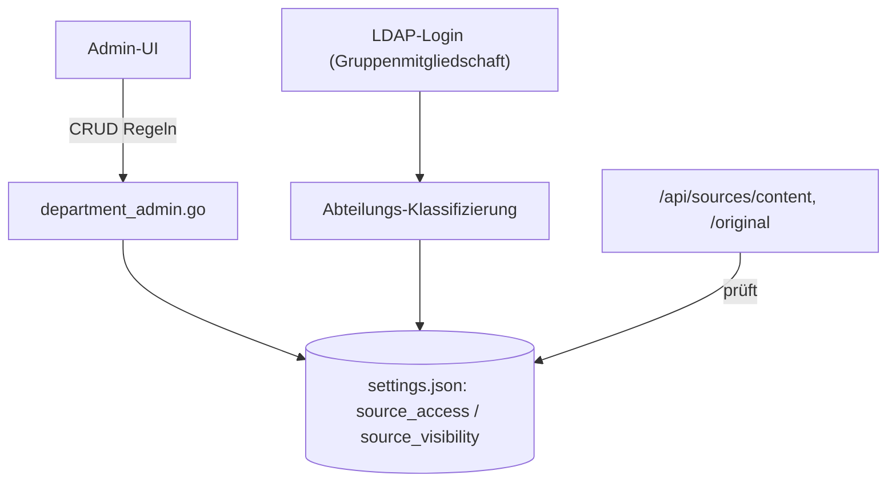

# Abteilungs-/Zugriffsregeln (`/api/department-rules*`)

**Verbindungsrolle:** Server
**Datenfluss:** gemischt – Lesen ist Pull, `save`/`reset` ist Push
**Schutz:** `requireAdminSession`
**Registrierung:** [handlers.go:193-195](../handlers.go)
**Implementierung:** `department_admin.go`

## Endpunkte

| Pfad | Zweck |
|---|---|
| `/api/department-rules` | Regeln auflisten/aktualisieren |
| `/api/department-rules/save` | Regelsatz speichern |
| `/api/department-rules/reset` | Auf Standard zurücksetzen |

## Zweck

Definiert, welche Abteilung/Nutzergruppe auf welche Quellen zugreifen darf
(`settings.SourceAccess`, `settings.SourceVisibility` – [settings.go:324](../settings.go)).
Wird u. a. von der LDAP-Anmeldung zur Klassifizierung genutzt.

## Zusammenhänge

- Durchgesetzt in [sources-chunks.md](sources-chunks.md) (`sourceAccessAllowedForRequest`)
- Klassifizierung erfolgt beim Login: [auth-ldap-login.md](auth-ldap-login.md), [ldap-directory-outgoing.md](ldap-directory-outgoing.md)
