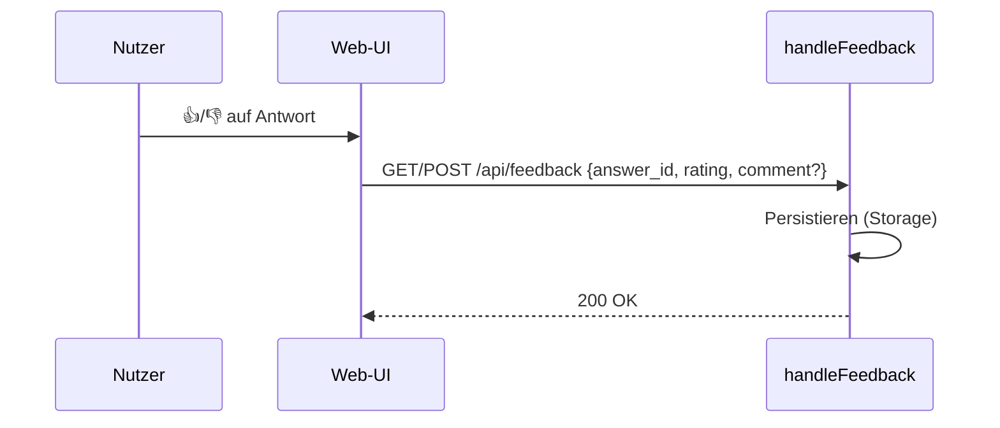

# Feedback (`/api/feedback`)

**Verbindungsrolle:** Server
**Datenfluss:** Push (Bewertung wird geschrieben, Antwort ist nur eine Bestätigung)
**Schutz:** ungegated (gleiches Vertrauensniveau wie `/api/ask`)
**Registrierung:** [handlers.go:185](../handlers.go)
**Implementierung:** `handleFeedback`, [feedback.go](../feedback.go)

## Zweck

Nimmt Daumen-hoch/-runter-Bewertungen (und optional Freitext-Kommentare) zu
einer zuvor gegebenen Antwort entgegen und persistiert sie zur späteren
Auswertung (z. B. Prompt-/Retrieval-Tuning).

## Technische Details

- **Speicherung:** append-only JSONL-Datei neben `settings.json`, Default
  `r3-feedback.jsonl` (`feedbackLogPath`, [feedback.go:21-25](../feedback.go)) –
  **kein** Eintrag im Vektor-Store/DB
- **Datensparsam:** der Volltext der Antwort wird **nicht** gespeichert, nur
  ein SHA-256-Hash davon (`AnswerHash`, [feedback.go:28-35](../feedback.go))
- Kein Admin-UI-Viewer bislang – Auswertung erfolgt direkt über die Log-Datei

## Zusammenhänge

- Bezieht sich auf Antworten aus [chat-ask.md](chat-ask.md)
