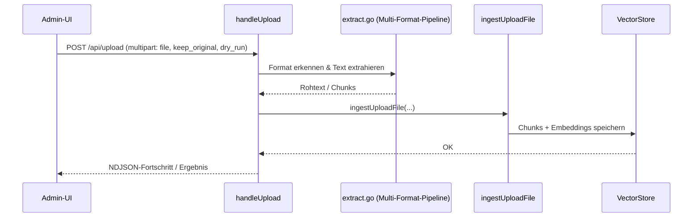

# Datei-Upload (`POST /api/upload`)

**Verbindungsrolle:** Server
**Datenfluss:** Push (Datei wird hochgeladen, Antwort ist Fortschritt/Ergebnis, keine substantielle Nutzlast zurück)
**Schutz:** `requireAdminSession`
**Registrierung:** [handlers.go:131](../handlers.go)
**Implementierung:** `handleUpload`, [handlers_import_files.go:14](../handlers_import_files.go)

## Zweck

Manueller Upload einzelner Dateien (PDF, DOCX, XLSX, Bilder, …) durch einen
Administrator zur Aufnahme in den Wissensspeicher.

## Request

Multipart-Formular:
- `file` – wiederholbares Feld, mehrere Dateien möglich
- `keep_original` – Original zusätzlich archivieren
- `dry_run` – nur Vorschau, kein tatsächliches Einfügen

Formulargrößen-Limit: **200 MB** ([handlers_import_files.go:19](../handlers_import_files.go)).

## Externe Prozessaufrufe (Text-Extraktion)

`extract.go` shellt für bestimmte Formate auf externe CLIs aus – **nur wenn
`settings.AllowShellExec == true`** ([settings.go:112](../settings.go)):

- **`markitdown`** (Office-/PDF-Textextraktion) – `exec.CommandContext`,
  Timeout **120 s** ([extract.go:145-171](../extract.go))
- **`tesseract`** (OCR-Fallback für Bilder, siehe auch
  [vision-attachments.md](vision-attachments.md)) – Timeout **60 s**
  ([extract.go:221](../extract.go))

Beide Aufrufe sind ein eigenständiges "R3 führt einen externen Prozess aus"-Interface
und betreffen sowohl den manuellen Upload hier als auch den Import-Pfad
([import-connectors.md](import-connectors.md)).

## Ablauf

## Zusammenhänge

- Nutzt dieselbe Extraktions-Pipeline wie die Import-Connectoren: [import-connectors.md](import-connectors.md)
- Speichert im selben Vektor-Store: [storage-backend.md](storage-backend.md)
