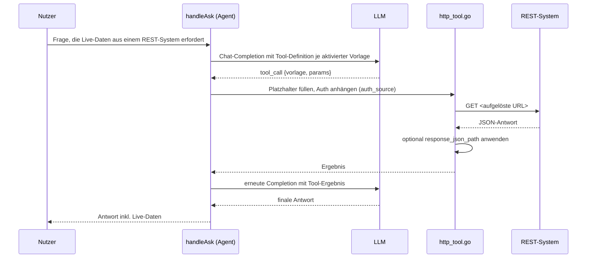

# HTTP-Abfragevorlagen & REST-Connectoren (ausgehende Live-Abfrage, Agent-Tool)

**Verbindungsrolle:** Client (R3 verbindet sich aktiv zum jeweils konfigurierten REST-System)
**Datenfluss:** Pull (nur `GET` erlaubt – R3 liest Daten ab, siehe Sicherheit unten)
**Implementierung:** [http_tool.go](../http_tool.go), [restconnector.go](../restconnector.go)

## Zweck

Die generische Analogie zu [mssql-tool.md](mssql-tool.md), aber für beliebige
REST-APIs statt SQL Server: ein Admin legt eine benannte, typisierte,
parametrisierte HTTP-`GET`-Vorlage an (`httpQueryTemplate`,
[settings.go:1276](../settings.go)); jede aktivierte Vorlage wird zu einem
eigenen Function-Calling-Tool mit typisiertem Parameter-Schema (Analogie zu
`mssqlTemplateToolDef`). Das Modell kann nur genau die vom Admin
geschriebene URL aufrufen, mit vom Modell gelieferten Werten in
`{name}`-Platzhaltern – nie eine vom Modell komponierte URL.

## Zwei Ebenen

1. **REST-Connector** (`restConnectorConfig`, `settings.rest_connectors[]`,
   [settings.go:1324](../settings.go)) – definiert **wohin** (`base_url`,
   nur `https`) und **wie authentifiziert** (`auth_type`: `none`/`basic`/
   `bearer`/`header`, plus Zugangsdaten). Ein REST-Connector hält selbst
   keine Daten und importiert nichts – er ist reiner Live-Zugriff, anders
   als die Import-Connectoren in [import-connectors.md](import-connectors.md).
2. **HTTP-Abfragevorlage** (`httpQueryTemplate`, `settings.http_templates[]`)
   – referenziert per `auth_source` entweder einen der eingebauten
   Basic-Auth-Connectoren (`confluence`/`jira`/`freshservice`, deren
   Zugangsdaten bereits konfiguriert sind) oder einen benannten
   REST-Connector (Fall 1). Die Vorlage selbst trägt die volle
   URL-Schablone (z. B. `https://logistic.rubix-intern.de/api/v1/orders/{order_id}`).

## Sicherheit (SSRF-Schutz)

`validateHTTPQueryTemplates` ([http_tool.go:115](../http_tool.go)) prüft
beim Speichern **zusätzlich zur Parameter-Konsistenz** (jeder deklarierte
Parameter muss in `url_template` als `{name}` vorkommen und umgekehrt), dass
der Host von `url_template` mit dem konfigurierten `base_url`-Host des
referenzierten `auth_source` übereinstimmt – ein Admin kann eine Vorlage
also nicht auf einen fremden Host zeigen lassen und dabei trotzdem die
Zugangsdaten eines Connectors "ausleihen". Nur `GET` ist erlaubt (mirror von
MSSQL-Tools SELECT-only-Haltung); ein `options`-Feld je Parameter kann
zusätzlich einen festen Werte-Katalog erzwingen (serverseitig durchgesetzt,
nicht nur als Modell-Hinweis).

## Antwort-Verschlankung

`response_json_path` (z. B. `"results"` oder `"tickets.0.status"`) extrahiert
optional nur ein Feld aus der JSON-Antwort statt der vollständigen Antwort
– verhindert, dass ein wortreicher API-Envelope das Kontextfenster des
Modells flutet (`extractJSONPath`).

## Verbindung testen

`/api/settings/test/http-template` ([handlers.go:113](../handlers.go)) prüft
eine noch ungespeicherte Vorlage inkl. Auth-Auflösung – siehe
[connection-tests.md](connection-tests.md).

## Ablauf

## Zusammenhänge

- Analoges Live-Tool-Prinzip: [mssql-tool.md](mssql-tool.md)
- Zugangsdaten-Felder (`username`/`password(_env)`, `token(_env)`,
  `header_name`): [CREDENTIALS.md](../CREDENTIALS.md)
- Aufgerufen aus [chat-ask.md](chat-ask.md)
- Protokolliert in [agent-audit.md](agent-audit.md)
- Verbindungstest: [connection-tests.md](connection-tests.md)
- Konfiguration/Feldliste: [settings-admin.md](settings-admin.md)
