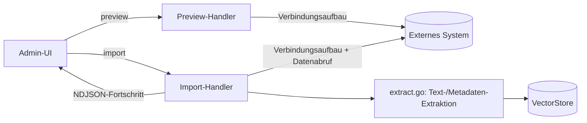

# Import-Connectoren (Massen-Import externer Quellen)

**Verbindungsrolle:** zweistufig – Trigger-seitig **Server** (Admin ruft R3 per HTTP auf), Ziel-seitig **Client** (R3 verbindet sich aktiv zum externen System)
**Datenfluss:** Trigger-seitig Request/Response (Preview) bzw. Push (Import anstoßen); Ziel-seitig **Pull** (R3 holt Dokumente/Mails/Seiten von der externen Quelle ab)
**Schutz:** alle `requireAdminSession`
**Registrierung:** [handlers.go:162-198](../handlers.go)

Alle Connectoren folgen demselben Muster: **Preview** (Trockenlauf, zeigt was
importiert würde) → **Import** (tatsächliches Einlesen, NDJSON-Fortschritts-Stream)
→ optional **Status/Cancel/Jobs** für lang laufende Importe. Ergebnisse landen als
Quellen/Chunks im gemeinsamen Vektor-Store ([storage-backend.md](storage-backend.md)).

## Übersicht der Connectoren

| Connector | Pfade | Datei | Externes Ziel |
|---|---|---|---|
| PST (Outlook-Archiv) | `/api/import/pst/preview`, `/preview-path`, `/api/import/pst`, `/status`, `/cancel`, `/jobs` | `handlers_import_pst.go`, `pst.go` | lokale/Netzlaufwerk `.pst`-Datei via `github.com/mooijtech/go-pst/v6` |
| SharePoint (Dokumentbibliothek) | `/api/import/sharepoint/preview`, `/api/import/sharepoint`, `/delta-sync` | `sharepoint.go` | Microsoft Graph API |
| SharePoint Site Pages (`.aspx`) | `/api/import/sharepoint/pages/preview`, `/api/import/sharepoint/pages` | `sharepoint.go` (`spListPages`/`spGetPageText`) | Microsoft Graph – separate API-Fläche von der Dokumentbibliothek oben (Wiki-/News-/Landingpage-Inhalte statt Dateien) |
| SharePoint ShareLink (einzeln geteilter Link) | `/api/import/sharepoint/sharelink` | `sharepoint.go` | Microsoft Graph – importiert genau die per SharePoints eigener "Link kopieren"-Aktion geteilte Datei/Seite, ohne vorherigen Preview-/Auswahlschritt |
| Exchange Online (Mail) | `/api/import/exchange/preview`, `/api/import/exchange` | `graphmail.go` | Microsoft Graph `/me/messages` |
| IMAP | `/api/import/imap` | `imapmail.go` | beliebiges IMAP-Postfach |
| Teams | `/api/import/teams/preview`, `/api/import/teams` | `teams.go` | Microsoft Graph (Kanal-Nachrichten) |
| Confluence | `/api/import/confluence/preview`, `/api/import/confluence` | `confluence.go` | Atlassian Cloud REST |
| Jira | `/api/import/jira/preview`, `/api/import/jira` | `jira.go` | Atlassian Cloud REST |
| Freshservice | `/api/import/freshservice/preview`, `/api/import/freshservice` | `freshservice.go` | `https://api.<domain>.freshservice.com/api/v2/` |
| Web/RSS | `/api/import/web`, `/api/import/rss` | `webimport.go`, `rss.go` | beliebige Webseiten / RSS-Feeds |
| Ordner-Import | `/api/import/folder` | `handlers_sources.go` | lokales Dateisystem |

## Authentifizierung je Connector

- **Microsoft Graph** (SharePoint, Exchange, Teams): OAuth2 Client-Credentials-Flow,
  `graphAuthHost = https://login.microsoftonline.com`,
  `graphBaseURL = https://graph.microsoft.com/v1.0` ([graph.go:36-37](../graph.go),
  Token-Logik [graph.go:153](../graph.go))
- **Confluence/Jira**: Basic-Auth (E-Mail + API-Token)
- **Freshservice**: Basic-Auth mit API-Key ([freshservice.go:14](../freshservice.go))
- **IMAP**: siehe [mail-draft-workflow.md](mail-draft-workflow.md) (gleiche `mailboxConfig`)
- **PST/Ordner/Web/RSS**: keine Auth bzw. Datei-/URL-Zugriff

## Discover: rekursive Struktur-Vorschau

Zusätzlich zu den `/preview`-Endpunkten (die jeweils eine Ordnerebene für
den eigentlichen Auswahl-Picker liefern) bieten SharePoint, Ordner-Import
und Exchange einen eigenen, rein lesenden **Discover**-Endpunkt
(`discover.go`): `/api/import/sharepoint/discover`,
`/api/import/folder/discover`, `/api/import/exchange/discover`
([handlers.go:183-185](../handlers.go)). Er liefert einen kompletten,
rekursiven Baum (Ordner/Dateien bzw. Mailbox-Ordner) auf einen Schlag statt
Ebene für Ebene nachzuladen – gedacht, um vor einem Import schnell zu
sehen, wie groß/tief eine Quelle tatsächlich ist, inkl. Zähler je Knoten
und einem Abschneide-Hinweis (`truncated`), falls der Baum eine interne
Obergrenze überschreitet.

## Mehrfach-Verbindungen je Connector-Art

Jeder Connector oben ist ein Array in `settings.json`
(`sharepoint[]`, `exchange_graph[]`, `imap[]`, `teams[]`, `confluence[]`,
`jira[]`, `freshservice[]`) – ein Admin kann also mehrere benannte
Verbindungen derselben Art parallel pflegen (z. B. zwei SharePoint-Sites
oder mehrere IMAP-Postfächer), jede mit eigenem Namen, eigenem
`PollInterval` und eigenem Enabled/Paused-Zustand. Siehe
[settings-admin.md](settings-admin.md) für das Verbindungskarten-Menü
(Testen/Duplizieren/Exportieren/Importieren/Entfernen).

## Wiederkehrender Import (Scheduler)

Alle Connectoren mit `PollInterval`/Sync-Konfiguration werden zusätzlich
periodisch vom Scheduler angestoßen, siehe [scheduler-admin.md](scheduler-admin.md).

## Konfiguration

Je Connector ein Array in `settings.json`: `sharepoint[]`, `exchange_graph[]`,
`imap[]`, `teams[]`, `confluence[]`, `jira[]`, `freshservice[]`
([settings.go](../settings.go)). Verbindungstests: [connection-tests.md](connection-tests.md).

## Größenlimits & externe Prozesse

- **PST-Import:** Formulargrößen-Limit **2 GB** ([handlers_import_pst.go:17](../handlers_import_pst.go))
- Extrahierte Inhalte durchlaufen dieselbe `extract.go`-Pipeline wie
  [file-upload.md](file-upload.md), inkl. optionaler `markitdown`-/`tesseract`-
  Subprozessaufrufe (nur bei `settings.AllowShellExec == true`)

## E-Mail-Anhänge (PST/IMAP/Exchange)

Alle drei Mail-Importer teilen sich dieselbe Anhang-Pipeline
(`extractAttachmentText`/`ingestEmailAttachment`, [ingest.go:269-355](../ingest.go)):
jeder Anhang wird als eigene, zitierbare Quelle eingebettet
(`source_id = "<parent>:attachment:<idx>:<filename>"`, gelöscht via
`deleteSourcesByPrefix` mit dem Löschen der Elternnachricht) statt in den
E-Mail-Text hineinkopiert zu werden.

- **Bild-Anhänge:** Inhalt wird per `http.DetectContentType` gesnifft (nicht
  nur die Dateiendung) – ein Bild läuft über denselben OCR-Pfad
  (`extractImageTextOCR`, `tesseract`) wie Chat/Agent-Bild-Uploads, statt wie
  zuvor pauschal als "unsupported" abgelehnt zu werden. Erfordert
  `settings.AllowShellExec == true`, sonst klarer Fehler statt stillem Skip.
- **Größenlimit:** `emailAttachmentMaxBytes` ([ingest.go:269](../ingest.go)),
  abgeleitet von `settings.Import.MaxFileMB` (Default 25 MB) – PST prüft
  zusätzlich `Attachment.GetAttachSize()` und Exchange das Graph-`size`-Feld
  jeweils **vor** dem vollständigen Lesen/Base64-Dekodieren, IMAPs
  `extractMailAttachments` bricht einen übergroßen Anhang jetzt sauber ab
  statt ihn (wie früher, fixer 50-MB-`LimitReader`) still zu kappen.
- **Warnungen statt stillem Skip:** übersprungene/fehlgeschlagene Anhänge
  (zu groß, nicht unterstützter Typ, OCR deaktiviert, Base64-Fehler bei
  Exchange) landen zusätzlich zum reinen Skipped-Zähler in
  `attachment_warnings` (`mailAttachmentWarnings`, [connector.go](../connector.go)) –
  eingebettet in jedes `XImportResult` der drei Connectoren und im
  Import-Ergebnis der Admin-UI sichtbar.
- **Live-Postfach ("Mein Postfach", `mail_graph.go`):** die interaktive
  Exchange-Nachrichtenansicht zeigte Anhänge bisher gar nicht an – jetzt
  werden sie bei `hasAttachments=true` mitgeladen, extrahiert und sowohl
  strukturiert (`mailGraphMessageResponse.Attachments`) als auch in
  `RawEmail` eingefügt, damit ein daraus erzeugter Antwortentwurf den
  Anhaltsinhalt kennt.
- **Antwortentwurf auf eine bereits importierte Quelle**
  (`handleDraftReply`, `source_id`-Pfad): Anhänge der Original-Mail werden
  deterministisch über den `source_id`-Präfix nachgeschlagen
  (`fetchAttachmentSourceContents`, [store.go](../store.go)) und in den
  Mail-Body eingefügt, statt sich auf zufälliges Auffinden per semantischer
  Suche zu verlassen.
