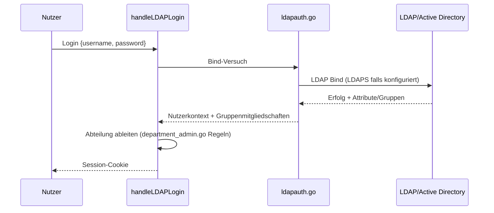

# LDAP/Active-Directory (ausgehend)

**Verbindungsrolle:** Client (R3 verbindet sich aktiv zum LDAP-Server)
**Datenfluss:** Pull (Bind bestätigt nur die Zugangsdaten – eigentlicher Zweck ist, Attribute/Gruppenmitgliedschaften abzuholen)
**Implementierung:** [ldapauth.go](../ldapauth.go), [ldaptls.go](../ldaptls.go)
**Bibliothek:** `github.com/go-ldap/ldap/v3`

## Zweck

Zwei Verwendungen:
1. **Login**: Bind gegen das Verzeichnis mit den vom Nutzer eingegebenen
   Zugangsdaten (`POST /api/auth/login`, siehe [auth-ldap-login.md](auth-ldap-login.md))
2. **Abteilungs-Klassifizierung**: Auslesen der Gruppenmitgliedschaften, um
   Abteilungs-/Zugriffsregeln anzuwenden (siehe [department-rules.md](department-rules.md))

## Konfiguration

`settings.LDAP` ([settings.go](../settings.go)) – Host, Port, Base-DN,
Bind-Muster, TLS-Optionen. Verbindungstest: `/api/settings/test/ldap`
(siehe [connection-tests.md](connection-tests.md)).

## Technische Details

- **Bibliothek/Aufbau:** `go-ldap/ldap/v3`, `DialURL` ([ldapauth.go:82-85](../ldapauth.go))
- **Protokoll/Port:** bestimmt durch `cfg.URL`-Schema (`ldap://` → Klartext/StartTLS,
  typ. Port 389; `ldaps://` → implizites TLS, typ. Port 636)
- **TLS:** `ldap.DialWithTLSConfig(ldapTLSConfig())` – vertraut dem OS-Zertifikatsspeicher
  plus einer eingebetteten internen CA-Chain (`certs/ldap_ca_chain.pem`,
  [ldaptls.go:29-47](../ldaptls.go))
- **Timeouts:** kein expliziter Timeout-Override im Code (Bibliotheks-/OS-Default)
- **Bruteforce-Schutz:** derselbe Limiter wie Admin-Login, 10 Fehlversuche/5 Min
  pro Client-IP (`ratelimit.go`)

## Ablauf

## Zusammenhänge

- Ergebnis fließt in Session/Auth: [auth-ldap-login.md](auth-ldap-login.md)
- Steuert Sichtbarkeit von Quellen: [department-rules.md](department-rules.md), [sources-chunks.md](sources-chunks.md)
