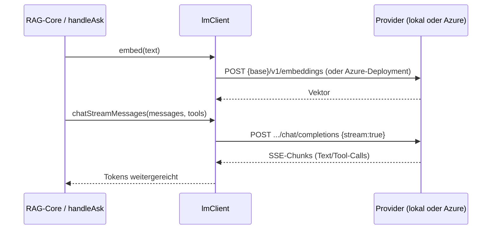

# LLM- & Embedding-Provider (ausgehend)

**Verbindungsrolle:** Client (R3 verbindet sich aktiv zum konfigurierten LLM-Endpunkt)
**Datenfluss:** Request/Response (Chat-Completion: Anfrage+Kontext rein, generierter Text raus); Embeddings sind eher Pull-artig (Text rein, Vektor raus), laufen aber über denselben Request/Response-Aufruf
**Implementierung:** [llm.go](../llm.go), zentraler Client `lmClient` ([llm.go:30-37](../llm.go))

## Zweck

Einheitlicher Client für alle Chat-/Embedding-Aufrufe. **Embeddings** laufen
bewusst ausschließlich über das lokale/OpenAI-kompatible Profil
(`activeEmbedModel`) – **Chat** kann dagegen gegen sechs verschiedene
Backends laufen: `local`, `azure`, `openai`, `openrouter`, `claude` oder
`gemini` (`isSupportedChatProfile`, [llm.go:177-184](../llm.go)). Lokal,
Azure, OpenAI und OpenRouter teilen sich dasselbe OpenAI-kompatible
Chat-Completions-Schema (Unterscheidung nur über `isAzure()`,
[llm.go:189-191](../llm.go)); Claude nutzt Anthropics eigene Messages API,
Gemini `GenerateContent` – beide mit eigener Request-/Response-Übersetzung
(`llm_claude.go`, `llm_gemini.go`), sodass nach außen (Tool-Calling,
Streaming, Vision) alle sechs Backends dasselbe interne `chatMsg`/`toolDef`-
Format sehen.

## Ziele

| Profil | Provider | Basis-URL (Default) | Endpunkte/Auth |
|---|---|---|---|
| Lokal/OpenAI-kompatibel | `local` | konfigurierbar, Default `http://localhost:1234` ([main.go:103](../main.go)) | `{base}/v1/models`, `{base}/v1/chat/completions`, `{base}/v1/embeddings`; Bearer-API-Key optional |
| Azure OpenAI | `azure` | `-azure-url` (kein Default, Resource-spezifisch) | `{base}/openai/deployments/{deployment}/chat/completions?api-version={version}` (`azureDeploymentURL`, [llm.go:200](../llm.go)), Default API-Version `2024-10-21`; Header `api-key` |
| OpenAI | `openai` | `https://api.openai.com/v1` | OpenAI-kompatibles Schema; Bearer-API-Key (`OPENAI_API_KEY`); Default-Modell `gpt-4o-mini` |
| OpenRouter | `openrouter` | `https://openrouter.ai/api/v1` | OpenAI-kompatibles Schema (Multi-Provider-Gateway); Bearer-API-Key (`OPENROUTER_API_KEY`); Default-Modell `openai/gpt-4o-mini` |
| Claude (Anthropic) | `claude` | `https://api.anthropic.com` | native Messages API, `{base}/v1/messages` ([llm_claude.go:56](../llm_claude.go)); Header `x-api-key` (`ANTHROPIC_API_KEY`); Default-Modell `claude-3-5-sonnet-20241022` |
| Gemini (Google) | `gemini` | `https://generativelanguage.googleapis.com` | native `GenerateContent`-API; Header `x-goog-api-key` (`GEMINI_API_KEY`); Default-Modell `gemini-2.0-flash` |

Konfiguriert über sechs benannte Profile unter `settings.Profiles`
(`Local`, `Azure`, `OpenAI`, `OpenRouter`, `Claude`, `Gemini`,
[settings.go:1801-1813](../settings.go)); `EmbedProfile`/`ChatProfile`
wählen, welches Profil Embeddings bzw. Chat bedient.

## Claude Prompt Caching

Für das `claude`-Profil markiert R3 gezielt zwei Stellen im Nachrichtenverlauf
mit Anthropics `cache_control: {type: "ephemeral"}` ([llm_claude.go:10-13,49](../llm_claude.go)):
das System-Prompt (statisch über eine Konversation hinweg) sowie – rollierend
– die jeweils letzte Nachricht (`markLastMessageForCache`,
[llm_claude.go:195-204](../llm_claude.go)), sodass ein mehrrundiger
Tool-Call-Dialog nicht bei jeder Runde den kompletten bisherigen Verlauf neu
berechnet. Gemini hat **kein** äquivalentes `cache_control`-Feld – dort ist
Caching ein separat anzulegender `CachedContent`-Ressourcentyp, bewusst
(noch) nicht implementiert, kein Versehen (siehe `llm_gemini.go`s
Paketkommentar). OpenAI/Azure/OpenRouter nutzen stattdessen ein
**automatisches, serverseitiges** Prompt-Caching ohne eigenes
`cache_control`-Feld – R3 macht dessen Wirkung sichtbar, indem
`prompt_tokens_details.cached_tokens` aus der Antwort ausgewertet und in
der Token-Nutzungs-Anzeige separat ausgewiesen wird ([llm.go:603-629](../llm.go)),
statt es als regulär abgerechnete Prompt-Tokens zu zählen.

## Technische Details

- **Protokoll:** HTTP/JSON; lokal/Azure/OpenAI/OpenRouter im
  OpenAI-kompatiblen Schema mit SSE-Streaming (`data: `-Zeilen), geparst in
  `chatStreamMessages`; Claude/Gemini nativ (siehe oben)
- **Default-URL lokal:** `http://localhost:1234` (`-url`-Flag, [main.go:103](../main.go))
- **Azure:** `-azure-url` (kein Default, Resource-spezifisch), API-Version
  Default `2024-10-21`
- **Auth:** je Profil ein anderes Schema – Bearer (lokal/OpenAI/OpenRouter),
  `api-key`-Header (Azure), `x-api-key` (Claude), `x-goog-api-key` (Gemini);
  inline oder via `*_env`-Variable (`newLMClientFromProfile`, siehe
  [CREDENTIALS.md](../CREDENTIALS.md) für die Reihenfolge inline-vs-Env)
- **TLS:** keine erzwungene TLS-Prüfung über das im Base-URL-Schema hinaus Konfigurierte
- **Timeout:** Client-Timeout **120 s** ([llm.go:145](../llm.go)); `ping()`
  wird beim Start aufgerufen, Fehler dabei sind nicht fatal

## Kernfunktionen

| Funktion | Zeile | Zweck |
|---|---|---|
| `ping()` | [llm.go:240](../llm.go) | Erreichbarkeitscheck |
| `listModels()` | [llm.go:265-273](../llm.go) | verfügbare Modelle abfragen |
| `embed()` | `llm.go` | Text → Embedding-Vektor |
| `chatStream` / `chatStreamMessages` | [llm.go:432-457](../llm.go) | Chat-Completion, streamt Tokens über `io.Writer` |

Tool-Calling im OpenAI-Function-Calling-Format ([llm.go:102-123](../llm.go)),
für Claude/Gemini intern übersetzt (`claudeTools`/`geminiTools`) – so kann
der Agent Tools wie MSSQL/HTTP-Abfragevorlagen/Shop/Sub-Agenten aufrufen
(siehe [mssql-tool.md](mssql-tool.md), [http-query-tool.md](http-query-tool.md),
[shop-connector.md](shop-connector.md), [agent-audit.md](agent-audit.md)).

Vision: Bilder werden als `image_url`-Content-Part mit
`data:<mime>;base64,...`-Data-URI gesendet ([chatimages.go:403-408](../chatimages.go)),
wenn `llmProfile.SupportsVision == true` – siehe [vision-attachments.md](vision-attachments.md).

## Ablauf

## Zusammenhänge

- Genutzt von [chat-ask.md](chat-ask.md), [mail-draft-workflow.md](mail-draft-workflow.md)
  (Entwurfserzeugung), allen Import-Connectoren (Embedding neuer Chunks)
- Verbindungstest: [connection-tests.md](connection-tests.md) (`/api/settings/test/llm`, `/llm-models`)
