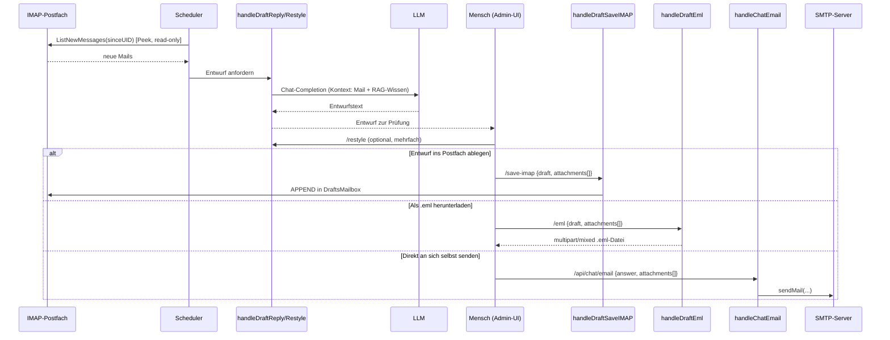

# Mail-Workflow: Antwortentwürfe, IMAP-Draft-Save, `.eml`-Export, Mail-Versand

**Verbindungsrolle:** zweistufig – HTTP-Endpunkte: **Server**; SMTP/IMAP: **Client** (R3 verbindet sich aktiv zum Mailserver)
**Datenfluss:** HTTP-Endpunkte überwiegend Request/Response (Entwurf erzeugen/anpassen) bzw. Push (`save-imap`, `chat/email` schreiben tatsächlich etwas); SMTP-Versand ist **Push**; IMAP-Fetch neuer Mails ist **Pull**; IMAP-`APPEND` (Draft speichern) ist **Push**
**Implementierung:** [draft.go](../draft.go), [mail.go](../mail.go), [imapmail.go](../imapmail.go), [mail_graph.go](../mail_graph.go) (native Outlook/Graph-Integration), [autodraft.go](../autodraft.go) (Exchange-Auto-Entwürfe)

Dies ist das "Human-in-the-loop"-Feature: R3 schlägt Antwort-Entwürfe auf
eingehende Mails vor, ein Mensch prüft/bearbeitet sie, und erst dann wird
tatsächlich etwas verschickt oder ins Postfach geschrieben. **R3 verschickt
nie automatisch ohne diesen Zwischenschritt.**

## Endpunkte

| Methode | Pfad | Schutz | Zweck | Handler |
|---|---|---|---|---|
| POST | `/api/draft/reply` | ungegated | LLM erzeugt Antwortentwurf zu einer Mail (nur Text, keine Mailbox-Aktion) | `handleDraftReply` [handlers.go:168](../handlers.go) |
| POST | `/api/draft/restyle` | ungegated | Entwurf im Ton/Stil anpassen | `handleDraftRestyle` [handlers.go:169](../handlers.go) |
| POST | `/api/draft/save-imap` | Admin | Entwurf (inkl. **Anhänge**) per IMAP `APPEND` in Drafts-Ordner ablegen | `handleDraftSaveIMAP` [handlers.go:173](../handlers.go) |
| POST | `/api/draft/eml` | ungegated | Entwurf (inkl. Anhänge) als `.eml`-Datei zum Download rendern | `handleDraftEml` [handlers.go:177](../handlers.go) |
| POST | `/api/chat/email` | ungegated (Session) | Chat-Antwort per SMTP an sich selbst senden ("send-self"), inkl. Anhänge | `handleChatEmail` [handlers.go:181](../handlers.go) |
| GET | `/api/mail/graph/options` | Session (LDAP) | Liste der Postfächer, für die der eingeloggte Nutzer interaktiven Graph-Zugriff hat | `handleMailGraphOptions` [mail_graph.go:166](../mail_graph.go) |
| GET | `/api/mail/graph/folders` | Session (LDAP) | Ordnerbaum eines gewählten Postfachs (Microsoft Graph, native Outlook-Integration) | `handleMailGraphFolders` [mail_graph.go:206](../mail_graph.go) |
| GET | `/api/mail/graph/list` | Session (LDAP) | Nachrichtenliste eines Ordners | `handleMailGraphList` [mail_graph.go:254](../mail_graph.go) |
| GET | `/api/mail/graph/message` | Session (LDAP) | Einzelne Nachricht lesen (Rohtext für `/api/draft/reply`) | `handleMailGraphMessage` [mail_graph.go:325](../mail_graph.go) |
| POST | `/api/mail/graph/save-draft` | Session (LDAP) | Entwurf **direkt per Graph** als Antwort-Entwurf im Postfach ablegen (kein Versand) | `handleMailGraphSaveDraft` [mail_graph.go:384](../mail_graph.go) |

## Native Outlook/Graph-Postfach-Integration (`mail_graph.go`)

Zusätzlich zum klassischen Copy-Paste-Workflow (Mail-Text manuell in den
Mail-Tab einfügen) kann ein eingeloggter Nutzer (LDAP-Session erforderlich –
"wessen Postfach" ergibt ohne echte Identität keinen Sinn) direkt sein
eigenes oder ein freigegebenes Team-Postfach über Microsoft Graph
durchsuchen, eine Nachricht auswählen und einen Entwurf **direkt als
Graph-Draft im Postfach** ablegen, ohne den Mail-Text von Hand zu
kopieren:

- Nutzt dieselben App-only-Graph-Zugangsdaten wie eine
  `exchange_graph[]`-Import-Verbindung (`InteractiveEnabled: true`) –
  keine zusätzliche pro-Nutzer-OAuth-Zustimmung nötig, da App-only-Auth im
  Namen jedes freigegebenen Postfachs agieren kann.
- **Autorisierung pro Verbindung:** `AllowedUsers`/`AllowedGroups`
  (AD-`memberOf`) auf der jeweiligen `exchange_graph[]`-Konfiguration –
  ein Nutzer ohne passende Verbindung sieht das Panel im Mail-Tab schlicht
  nicht (rein additiv, der bestehende Copy-Paste-Weg bleibt unverändert
  nutzbar).
- Jede Verbindung stellt entweder das **eigene** Postfach des Anrufers
  (`sessionClaims.Mail`, Standardfall) oder – falls `InteractiveShared`
  gesetzt ist – ein festes **Team-Postfach** (z. B. `vertrieb@rubix.com`)
  als Option bereit ([mail_graph.go:22-26](../mail_graph.go)).
- Entwurfserzeugung läuft über denselben `/api/draft/reply`-Pfad (der
  Rohtext der ausgewählten Graph-Nachricht wird einfach als `raw_email`
  übergeben) – kein zweiter Generierungs-Codepfad.
- **Nur Ablegen, nie Versand:** `handleMailGraphSaveDraft` legt den
  Entwurf per Graph als Antwort-Draft im Postfach ab
  (`createExchangeGraphDraft`) – dasselbe "R3 verschickt nie selbst"-Prinzip
  wie beim IMAP-`APPEND`-Pfad oben.

## Länge/Format-Steuerung & situativer Kontext

`POST /api/draft/reply` und die "Neue E-Mail"-Variante (`Brief`-Feld)
akzeptieren zusätzlich optionale, serverseitig gegen einen festen Katalog
aufgelöste Steuerfelder (`draftReplyRequest`, [settings.go](../settings.go)/
`draft.go`s `draftFormatInstruction`) – ein Client kann damit keinen
beliebigen Prompt-Text einschleusen:

- `length` / `format` – Ton/Länge-Vorgaben für den generierten Entwurf
  (leer = Modell-Standard); steuern nur Form, nie den Fakteninhalt, der
  weiterhin aus dem abgerufenen Kontext stammt
- `instructions` – freier "situativer Kontext" (z. B. ein bevorstehender
  Kundentermin), der als explizite Anweisung in den Generierungs-Prompt
  einfließt, aber nie als Tatsachenwissen über das eigentliche Thema
  behandelt wird

## Unbeaufsichtigte Auto-Entwürfe (Exchange, Scheduler-getrieben)

`exchangeGraphConfig.EnableAutoDraftRules` + `AutoDraftRules[]`
([settings.go:879-907,957-982](../settings.go)) erlauben es, den
Entwurfs-Workflow für eine Exchange-Verbindung zu automatisieren: bei
jedem periodischen Sync (Scheduler, [scheduler.go:431-443](../scheduler.go))
wird jede neu gesehene Nachricht gegen die konfigurierten Regeln geprüft
(`matchAutoDraftRule`, `autodraft.go`) – matcht eine Regel, wird
automatisch ein Entwurf erzeugt und **abgelegt** (nie versendet). Eine
Regel prüft wahlweise `from` oder `subject` als case-insensitiven
Substring-Test, optional negiert (`Negate`, z. B. "Absender enthält NICHT
rubix.com" für eine Extern-Absender-Regel). `AutoDraftedIDs` ist der
Dedup-Cursor, der verhindert, dass dieselbe Nachricht mehrfach geprüft
wird. **Auch hier gilt unverändert: R3 versendet nie automatisch** – der
Auto-Entwurf landet im Drafts-Ordner zur menschlichen Prüfung, exakt wie
ein manuell angestoßener Entwurf.

## Anhänge-Feature (aktueller Change, siehe `chatimages.go`-Diff und Commit `b0edcd5`)

Beide Schreibpfade unterstützen jetzt Datei-Anhänge nach demselben
Base64-über-JSON-Muster wie die Chat-Bildanhänge:

- `mailAttachmentInput` – [mail.go:120-123](../mail.go)
- `decodeMailAttachments` – [mail.go:134-157](../mail.go) (Limits: **5 Anhänge, je max. 15 MB**)
- `buildMultipartEmail` – [mail.go:63-112](../mail.go) baut korrektes `multipart/mixed`-MIME

## Ablauf

## Ausgehend: SMTP (`mail.go`)

- `sendMail(cfg smtpConfig, to, subject, body string, attachments ...mailAttachment) error`
  – [mail.go:163](../mail.go), nutzt Standardbibliothek `net/smtp.SendMail`
  (STARTTLS automatisch ausgehandelt) mit `smtp.PlainAuth` ([mail.go:185](../mail.go))
- Einzige Aufrufer: `handleChatEmail` (send-self) und der `.eml`-Baupfad für den Download
- Konfiguration: `settings.SMTP` ([settings.go:252](../settings.go)),
  Verbindungstest über [connection-tests.md](connection-tests.md)
- **Technische Details:** Default-Port **25**, falls `cfg.Port<=0`
  ([mail.go:177-194](../mail.go)); STARTTLS wird von `smtp.SendMail`
  automatisch verifizierend ausgehandelt, kein eigenes TLS-Config-Override;
  Auth nur wenn Username gesetzt; **kein explizites Dial-/Write-Timeout**
  (verlässt sich auf OS-/Netzwerk-Defaults)

## Eingehend: IMAP (read-only, `imap.go` + `imapmail.go`)

- `mailboxConfig` – [imap.go:31-57](../imap.go): Host, Port, Username,
  Password/PasswordEnv, Mailbox, UseTLS, PollInterval, DraftsMailbox, LastUID
- `imapClient`-Interface – [imap.go:93-103](../imap.go):
  `ListNewMessages(ctx, sinceUID) ([]incomingMail, error)`, implementiert von
  `realIMAPClient` in [imapmail.go](../imapmail.go) (`github.com/emersion/go-imap/v2`)
- **Read-only** via `Peek` ([imapmail.go:147](../imapmail.go)) – setzt nie `\Seen`,
  löscht nie
- Draft-Schreibpfad: `saveDraftToMailbox` schreibt via IMAP `APPEND`
  ([imapmail.go:232-233](../imapmail.go)) in `DraftsMailbox` (Standard: „Drafts“)
- Konfiguration: `settings.IMAP []mailboxConfig` ([settings.go:226](../settings.go)),
  ein Eintrag pro Postfach; Scheduler pollt je Postfach im konfigurierten
  `PollInterval` ([scheduler.go:325,339](../scheduler.go))
- **Technische Details:** Default-Port **993** (implizites TLS), falls
  `cfg.Port==0` ([imapmail.go:33-52](../imapmail.go)); `DialTLS` (implizites
  TLS) oder `DialInsecure`, gesteuert über `cfg.UseTLS`; **kein explizites
  Dial-Timeout**; pro Poll-Zyklus wird eine **neue Verbindung** aufgebaut
  (kein dauerhaftes IDLE); Anhänge-Limits (siehe oben): 5 Anhänge, je max. 15 MB

## Zusammenhänge

- Teilt die Anhang-Konvention mit [vision-attachments.md](vision-attachments.md)
- Import bestehender Mails (nicht Antwort-Workflow) läuft separat: [import-connectors.md](import-connectors.md) (IMAP-/Exchange-Import)
- Konfigurationstest: [connection-tests.md](connection-tests.md)
- Auto-Entwurfs-Lauf ausgelöst vom Scheduler: [scheduler-admin.md](scheduler-admin.md)
- Feldliste/Konfiguration: [settings-admin.md](settings-admin.md)
