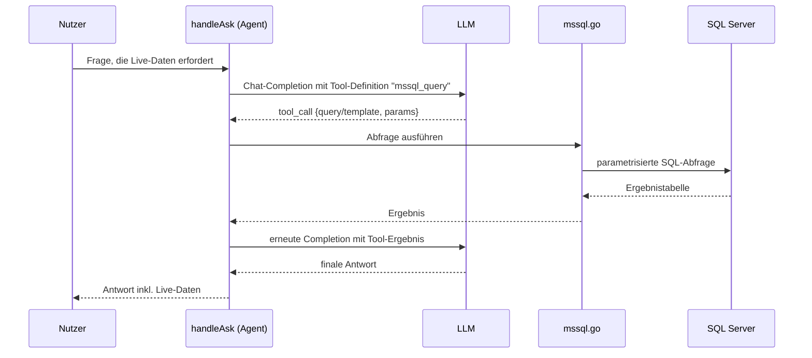

# MSSQL-Tool (ausgehende Live-Abfrage, Agent-Tool)

**Verbindungsrolle:** Client (R3 verbindet sich aktiv zum SQL Server)
**Datenfluss:** Pull (nur `SELECT` erlaubt – R3 liest Daten ab, siehe Sicherheits-Abschnitt unten)
**Implementierung:** [mssql.go](../mssql.go)

## Zweck

Kein Bestandteil des Wissensspeichers, sondern ein **Live-Tool**, das der
RAG-Agent während `/api/ask` per Tool-Calling aufrufen kann, um aktuelle
Daten direkt aus einem SQL Server abzufragen (z. B. Bestellstatus,
Lagerbestand), statt vorab importierte/embeddete Daten zu nutzen.

## Verbindung

- `sql.Open("sqlserver", dsn)` – [mssql.go:179](../mssql.go)
- Konfiguration: `settings.MSSQL` ([settings.go](../settings.go))
- Verbindungstest: `/api/settings/test/mssql`, `/api/settings/test/mssql-template`
  (siehe [connection-tests.md](connection-tests.md))

## Technische Details

- **Protokoll:** TDS über `database/sql` mit `sqlserver`-Treiber ([mssql.go:40-65](../mssql.go))
- **Port:** Default **1433**, falls `cfg.Port<=0`
- **TLS/Auth:** `TrustServerCertificate`-Query-Parameter (konfigurierbar),
  Benutzer/Passwort in der DSN
- **Limits:** `MaxRows`/`TimeoutSeconds` begrenzen den "Blast Radius" einer
  Abfrage ([settings.go:830](../settings.go), [connruntime.go:53](../connruntime.go))

## Ablauf

## Sicherheit

Abfragen laufen über vordefinierte, admin-konfigurierte Templates
(`mssql-template`-Test), nicht über beliebigen vom LLM generierten SQL-Text –
begrenzt das Risiko von SQL-Injection durch das Modell. Zusätzlich blockt
`validateSelectOnly` ([mssql.go:80-102](../mssql.go)) explizit DML/DDL/`EXEC`/
`xp_`/`sp_`-Aufrufe – es sind nur `SELECT`-Abfragen zulässig.

## Zusammenhänge

- Aufgerufen aus [chat-ask.md](chat-ask.md)
- Protokolliert in [agent-audit.md](agent-audit.md)
