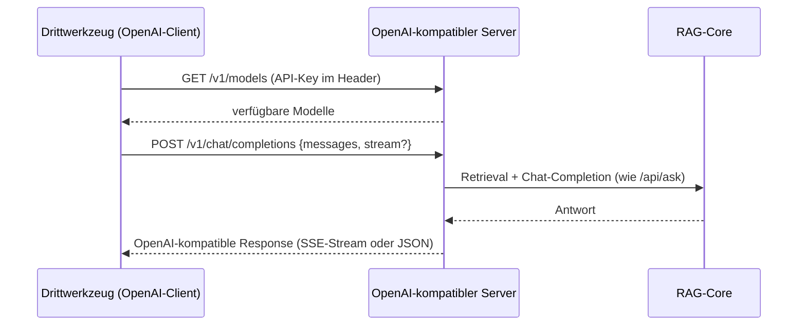

# OpenAI-kompatibler API-Server (`/v1/chat/completions`, `/v1/models`)

**Verbindungsrolle:** Server (eigener Listener, separater Port)
**Datenfluss:** Request/Response (`/v1/chat/completions`), Pull (`/v1/models`)
**Schutz:** `requireOpenAIAPIKey`
**Implementierung:** [openai_api.go](../openai_api.go)

## Zweck

Macht R3s RAG-Antworten über eine zu OpenAI kompatible Schnittstelle
verfügbar, sodass beliebige Drittwerkzeuge (die einen OpenAI-Client
unterstützen) R3 als Backend nutzen können.

## Endpunkte

| Methode | Pfad | Handler |
|---|---|---|
| GET | `/v1/models` | `handleOpenAIModels` – [openai_api.go:539](../openai_api.go) |
| POST | `/v1/chat/completions` | `handleOpenAIChatCompletions(rag)` – [openai_api.go:540](../openai_api.go); Streaming-Variante `handleOpenAIChatCompletionsStream` – [openai_api.go:450](../openai_api.go) |

## Lebenszyklus

Eigener `http.Server` auf `settings.OpenAIAPI.Port`, standardmäßig
**deaktiviert** (`openAIAPIConfig.Enabled == false`). Wird gestartet/gestoppt
über `reconcileOpenAIAPIServer` ([openai_api.go:519](../openai_api.go)) –
sowohl beim Programmstart ([main.go:213](../main.go)) als auch bei jedem
Speichern der Einstellungen (siehe [settings-admin.md](settings-admin.md)).

## Technische Details

- **Protokoll:** HTTP/1.1; Streaming über Server-Sent Events (`data: ...\n\n`,
  Abschluss mit `data: [DONE]`) bei `stream:true`
- **Port:** frei konfigurierbar über `settings.OpenAIAPI.Port`, **kein
  Hardcoded-Default** – Betreiber muss ihn explizit setzen
- **TLS:** kein TLS im Prozess (wie Hauptserver)
- **Auth:** `requireOpenAIAPIKey` – Bearer-artiger API-Key im Header
- **Timeouts:** sauberes Herunterfahren mit 5 s Timeout beim Reconcile/Stop
  ([openai_api.go:529](../openai_api.go)); nutzt ansonsten dieselben LLM-Aufruf-Timeouts wie [llm-embedding-provider.md](llm-embedding-provider.md)

## Zusammenhänge

- Nutzt intern dieselbe RAG-Pipeline wie [chat-ask.md](chat-ask.md)
- Zugriffssteuerung analog zu API-Keys: [apikeys.md](apikeys.md)
- Konfiguration: `settings.OpenAIAPI` ([settings-admin.md](settings-admin.md))
