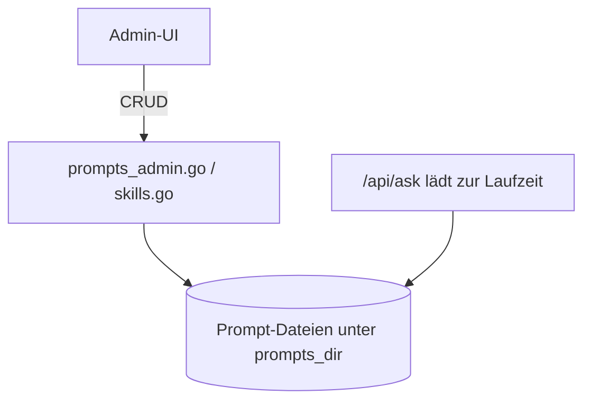

# Prompt-/Skill-Verwaltung (`/api/prompts*`, `/api/skill*`)

**Verbindungsrolle:** Server
**Datenfluss:** gemischt – Lesen ist Pull, Schreiben/Löschen ist Push
**Schutz:** `requireAdminSession`
**Registrierung:** [handlers.go:187-192](../handlers.go)
**Implementierung:** `prompts_admin.go`, `skills.go`

## Endpunkte

| Pfad | Zweck |
|---|---|
| `/api/prompts` | System-Prompts auflisten/aktualisieren |
| `/api/prompts/index` | Prompt-Index (Übersicht/Suche) |
| `/api/prompts/draft` | Prompt-Entwurf erzeugen/bearbeiten |
| `/api/prompts/agent` | Agenten-spezifischen Prompt konfigurieren |
| `/api/prompts/skill` | Skill-spezifischen Prompt konfigurieren |
| `/api/prompts/skill/delete` | Skill-Prompt löschen |

## Zweck

Erlaubt Administratoren, die System-Prompts (Basis-Instruktionen, Presets,
Agenten-Verhalten, einzelne "Skills"/Fähigkeiten) zu pflegen, ohne den Code
anzufassen. Prompts liegen unter `settings.PromptsDir`.

## Zusammenhänge

- Prompts werden zur Laufzeit von [chat-ask.md](chat-ask.md) und dem
  Mail-Entwurfs-Workflow ([mail-draft-workflow.md](mail-draft-workflow.md)) genutzt
- Presets: `GET /api/presets` ([handlers.go:126](../handlers.go))
