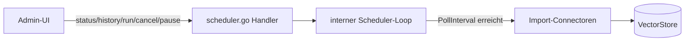

# Scheduler-Dashboard (`/api/scheduler/*`)

**Verbindungsrolle:** Server (Dashboard); steuert selbst keine Netzwerkverbindung, sondern den internen Ticker – die eigentlichen Client-Verbindungen laufen in [import-connectors.md](import-connectors.md)
**Datenfluss:** gemischt – Status/Historie lesen ist Pull, `run`/`cancel`/`pause` ist Push
**Schutz:** `requireAdminSession`
**Registrierung:** [handlers.go:97-101](../handlers.go)
**Implementierung:** `scheduler.go`

## Endpunkte

| Pfad | Zweck |
|---|---|
| `/api/scheduler/history` | Historie vergangener Sync-/Import-Läufe |
| `/api/scheduler/status` | Aktueller Status aller geplanten Jobs |
| `/api/scheduler/run` | Job sofort auslösen |
| `/api/scheduler/cancel` | laufenden Job abbrechen |
| `/api/scheduler/pause` | Job pausieren/fortsetzen |

## Zweck

Der Scheduler stößt periodisch die konfigurierten Import-Connectoren an
(IMAP-Poll, SharePoint-Delta-Sync, Freshservice-Sync, …) – siehe
[import-connectors.md](import-connectors.md). Diese Routen erlauben es,
diesen Hintergrundprozess zu beobachten und manuell zu steuern.

## Technische Details

- **Mechanismus:** kein OS-Cron, sondern ein einfacher `time.NewTicker`
  in-process ([scheduler.go:221](../scheduler.go)), Tick-Intervall
  **30 Sekunden** (`schedulerTick`, [scheduler.go:208](../scheduler.go)) –
  bei jedem Tick wird geprüft, welcher Connector laut seinem
  `PollInterval` fällig ist
- **Historie:** Lauf-Historie wird append-only als JSONL persistiert
  (gleiches Muster wie [agent-audit.md](agent-audit.md) und
  [feedback.md](feedback.md))

## Zusammenhänge

- Steuert dieselben Connectoren wie [import-connectors.md](import-connectors.md)
- IMAP-Polling im Mail-Workflow: [mail-draft-workflow.md](mail-draft-workflow.md)
