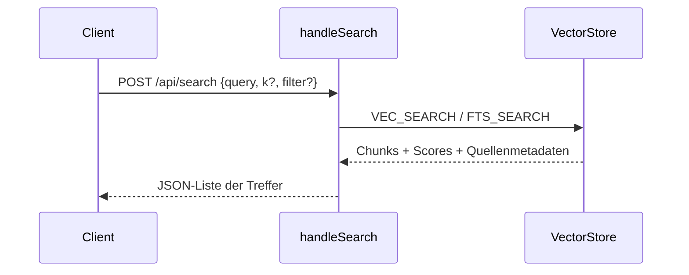

# `POST /api/search` – Reine Retrieval-Suche

**Verbindungsrolle:** Server
**Datenfluss:** Pull (kleine Suchanfrage rein, Trefferliste ist die eigentliche Nutzlast zurück)
**Schutz:** `requireAPIKey`
**Registrierung:** [handlers.go:128](../handlers.go)
**Implementierung:** `handleSearch`, [handlers.go:1640](../handlers.go)

## Zweck

Führt nur die Retrieval-Stufe des RAG-Pipelines aus (Vektor-/Volltextsuche gegen
den Chunk-Store) **ohne** eine LLM-Antwort zu generieren. Nützlich für Debugging,
eigene Frontends oder Auswertungen, die selbst über die Treffer entscheiden wollen.

## Request / Response

Antwort enthält je Treffer: Quelle (Datei/Mail/Seite), Chunk-Text, Score,
Metadaten (z. B. Abteilung, Zeitstempel) – abhängig von `settings.Ranking`.

## Zusammenhänge

- Nutzt denselben Vektor-Store wie `/api/ask`: [storage-backend.md](storage-backend.md)
- Zugriffsbeschränkung pro Abteilung greift auch hier (`SourceAccess`, siehe
  [department-rules.md](department-rules.md))
