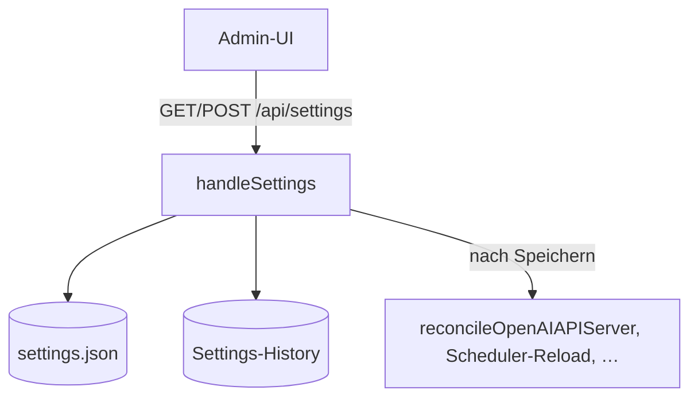

# Konfigurationsverwaltung (`/api/settings*`)

**Verbindungsrolle:** Server
**Datenfluss:** gemischt – `GET` ist Pull (Konfiguration/History lesen), `POST` ist Push (Konfiguration schreiben)
**Schutz:** `requireAdminSession`
**Registrierung:** [handlers.go:72-73](../handlers.go)
**Implementierung:** `handleSettings`, `settings.go`, `settings_history.go`

## Endpunkte

| Methode | Pfad | Zweck |
|---|---|---|
| GET | `/api/settings` | aktuelle Konfiguration lesen |
| POST | `/api/settings` | Konfiguration aktualisieren (schreibt `settings.json`) |
| GET | `/api/settings/history` | Änderungshistorie der Konfiguration |

## Konfigurationsdatei (`settings.json`)

Struct `appSettings` – [settings.go:54-363](../settings.go). Wichtige Felder:

`version`, `lang`, `profiles.{local,azure,openai,openrouter,claude,gemini}`,
`embed_profile`, `chat_profile`,
`chunk_size`, `k`, `redact_pii`, `disable_streaming`,
`storage{backend,mode,path,max_memory_mb}`, `ranking`,
`import{allow_internal_fetch,…}`,
`upload{image_mode,vision_profile,vision_max_dim,vision_jpeg_quality,max_attachment_mb,max_prompt_chars}`,
`allow_shell_exec`, `prompts_dir`,
`admin_password_env`, `url_mappings[]`, `enable_draft_replies`,
`draft_chat_profile`, `draft_preset`, `enable_chat_history`,
`chat_history_path`, `ldap`, `sharepoint[]`, `exchange_graph[]` (inkl.
`enable_auto_draft_rules`/`auto_draft_rules[]`, siehe
[mail-draft-workflow.md](mail-draft-workflow.md)), `imap[]`,
`teams[]`, `confluence[]`, `jira[]`, `freshservice[]`, `smtp`, `mssql`,
`shop`, `http_templates[]`, `rest_connectors[]` (siehe
[http-query-tool.md](http-query-tool.md)), `agent`, `tool_router`, `api`,
`openai_api`, `source_visibility{}`, `source_access{}`, `presets[]`,
`personalize_answers`.

`lang` (Server-UI-Sprache) unterstützt aktuell **de/en/fr/it**; jede
Nutzerin kann zusätzlich per Sidebar-Umschalter eine persönliche
Override-Sprache wählen (`web/i18n.js`), unabhängig vom Server-Default.

Geladen/erzeugt über `loadOrCreateSettings` (`settings.go`).

## CLI-Flags (nur beim Erststart wirksam, danach übersteuert `settings.json`)

| Flag | Default | Zweck |
|---|---|---|
| `-addr` | `:8090` | Server-Adresse/Port |
| `-verbose` | `false` | jeden Request + verwendetes LLM-Modell loggen |
| `-storage-backend` | `tinysql` | `tinysql`\|`sqlite` |
| `-storage-path` | `r3-data` | Speicherort (Datei/Ordner je Backend/Modus) |
| `-storage-mode` | `disk` | tinySQL-Modus: `memory`\|`wal`\|`disk`\|`index`\|`hybrid` |
| `-storage-max-mem-mb` | `256` | Speicherobergrenze für `index`/`hybrid` |
| `-migrate-from-backend` / `-migrate-from-path` / `-migrate-from-mode` | – | einmalige Migration, Prozess beendet sich danach (siehe [storage-backend.md](storage-backend.md)) |
| `-settings` | `settings.json` | Pfad zur Konfigurationsdatei |
| `-url` | `http://localhost:1234` | lokale LLM-Basis-URL (OpenAI-kompatibel) |
| `-chat` | `mistralai/ministral-3-3b` | lokaler Chat-Modellname |
| `-embed` | `text-embedding-nomic-embed-text-v1.5` | lokaler Embedding-Modellname |
| `-azure-url`, `-azure-chat-deployment`, `-azure-embed-deployment`, `-azure-api-version` | – / `2024-10-21` | Azure-OpenAI-Konfiguration |
| `-lang` | `de` | UI-/Antwortsprache |
| `-chunk` | `800` | Chunk-Größe für Text-Splitting |
| `-k` | `5` | Anzahl abgerufener Chunks als Chat-Kontext |

Quelle: [main.go:93-112](../main.go).

## Mehrfach-Verbindungen je Connector-Art

Jede Connector-Art (SharePoint, Exchange, IMAP, Teams, Confluence, Jira,
Freshservice, REST-Connectoren, …) ist ein Array in `settings.json` – ein
Admin kann also mehrere benannte Verbindungen derselben Art parallel
konfigurieren (z. B. zwei SharePoint-Sites). Jede Verbindungskarte
(`connCard`, `web/app.js`) bietet über ein „⋮"-Menü (`connCardMenu`):
**Testen** (siehe [connection-tests.md](connection-tests.md)),
**Duplizieren**, **Exportieren**/**Importieren** (Einzelverbindung als
eigenständige `.json`-Datei, markiert mit einem
`_r3_connector_kind`-Feld, damit ein Import in die falsche Connector-Art
abgelehnt wird) sowie **Entfernen**. Für SharePoint/Exchange/Ordner-Import
bietet die Karte zusätzlich einen **Discover**-Button (rekursive,
rein lesende Struktur-Vorschau, `discover.go`, `/api/import/{sharepoint,
folder,exchange}/discover`) – siehe [import-connectors.md](import-connectors.md).

## Ablauf

Jedes Speichern von Settings triggert u. a. `reconcileOpenAIAPIServer`
([openai_api.go:519](../openai_api.go)), damit z. B. ein aktivierter/deaktivierter
OpenAI-kompatibler Server sofort greift – siehe [openai-compatible-api.md](openai-compatible-api.md).

## Zusammenhänge

- CLI-Flags setzen nur **Erststart-Defaults**, danach ist `settings.json` maßgeblich
- Verbindungstests für die hier konfigurierten Connectoren: [connection-tests.md](connection-tests.md)
