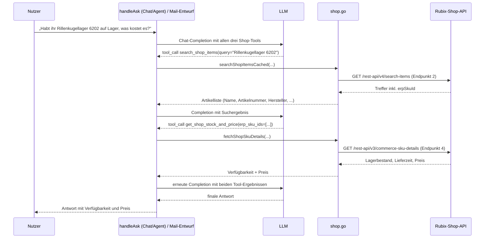

# Rubix-Shop-Connector (ausgehend, drei Agent-Tools)

**Verbindungsrolle:** Client (R3 verbindet sich aktiv zur Shop-API)
**Datenfluss:** Pull (Produktsuche, Produkt-/Bestandsdaten abfragen — keine
schreibenden Aufrufe, siehe [Sicherheit](#sicherheit))
**Implementierung:** [shop.go](../shop.go), Konfiguration `shopConfig`
([settings.go:997](../settings.go))

## Zweck

Bindet Rubix' eigenes B2B-Shop-Backend (de.rubix.com) als **drei getrennte
Live-Tools** für Chat/Agent/Mail-Entwürfe ein (nicht Bestandteil des
Wissensspeichers — nichts hiervon wird importiert/eingebettet, jede Abfrage
läuft live zum Zeitpunkt der Antwort, siehe [mssql-tool.md](mssql-tool.md)
für dasselbe Grundprinzip bei einer anderen Live-Quelle):

| Tool-Name | Zweck | Ruft auf | Gecached? |
|---|---|---|---|
| `search_shop_items` | Volltextsuche nach Artikeln (Name, Artikelnummer, Hersteller, EAN, technische Kerndaten) | Endpunkt 2 | 5 Min. ([shopSearchCacheTTL](../shop.go:463)) |
| `get_shop_product_details` | Löst eine bereits bekannte Produkt-ID (z. B. aus einer alten Bestellung/URL) zu Name/Hersteller/Artikelnummer auf | Endpunkt 3 | nein |
| `get_shop_stock_and_price` | Aktueller Lagerbestand, Lieferzeit, Preis zu bereits bekannten Artikeln (per Artikelnummer) | Endpunkt 4 | nein, bewusst nie (siehe unten) |

**Warum drei statt ein Tool:** Das Modell soll selbst entscheiden, *wann* es
welche Information braucht, statt bei jeder Suche pauschal alles mitzuladen.
Preis/Bestand ändern sich laufend — sie in jedes Suchergebnis zu bündeln wäre
entweder teuer (Live-Abfrage bei jedem Treffer, nicht nur bei tatsächlichem
Bedarf) oder irreführend veraltet (gecached). Die drei Tools bilden zusammen
den natürlichen Ablauf eines menschlichen Vertriebsmitarbeiters ab: suchen →
ggf. eine bereits bekannte Referenz auflösen → gezielt Verfügbarkeit/Preis für
die tatsächlich relevanten Artikel prüfen. Alle drei werden gemeinsam über
dieselbe `shop`-Werkzeugkategorie freigeschaltet (Zugriffs-Presets) — sie sind
Facetten eines Connectors/Kontos, nicht einzeln einschränkbar
([appendShopTool](../shop.go:965)).

## Authentifizierung

Token-basiert gegen Endpunkt 1 (siehe `/api/settings/test/shop-login` in
[connection-tests.md](connection-tests.md)); Konfiguration unter
`settings.Shop` ([settings.go:997](../settings.go)). Zwei vom Shop-Backend
tatsächlich beobachtete Ausprägungen, beide unterstützt
([shopAccessToken](../shop.go:211)):

- **Bearer-Token**: JSON-Antwort mit einem Token-Feld (Feldname nicht
  vollständig bestätigt, `parseShopTokenResponse` prüft mehrere plausible
  Namen defensiv) — Token im `Authorization: Bearer …`-Header jeder
  Folgeanfrage.
- **Cookie-Session**: manche Konten erhalten stattdessen einen leeren Body
  plus `Set-Cookie`-Header (oft mit `Userid`-Header) — die Session-Cookies
  werden in einer geteilten `http.CookieJar` gehalten und an jede
  Folgeanfrage angehängt, **kein** `Authorization`-Header in diesem Fall.

Token/Cookie-Session werden pro Basis-URL+Benutzername gecacht
(`shopTokenCache`) und ~60 s vor Ablauf automatisch erneuert. Ein 401 auf
eine gecachte, client-seitig noch gültig aussehende Session löst **genau
einen** erzwungenen Neu-Login plus Wiederholung aus, bevor endgültig
fehlgeschlagen wird ([shopAuthedGet](../shop.go:491), gemeinsame Logik für
Endpunkte 2–4). `client_id`/`client_secret` sind das feste, geteilte
"Browser-API-Client"-Credential-Paar des Shop-Frontends selbst (nicht
kontospezifisch, aber dennoch als Secret-Feld in `settings.Shop` konfiguriert
statt fest im Code verankert).

## Externe REST-Endpunkte

Alle vier über reales, live erfasstes Traffic bestätigt (Browser-Devtools
gegen eine authentifizierte Session) — nicht dokumentiert von Rubix
(`robots.txt` sperrt sogar das Crawlen von `/rest-api/v1/tokens`) und nicht
aus einer plausiblen SAP-Commerce/Hybris-Konvention geraten. Siehe
[shop.go](../shop.go)s Paketkommentar für die vollständige Herleitung.

| # | Methode & Pfad | Zweck | Antwort-Kernfelder | Go-Funktion |
|---|---|---|---|---|
| 1 | `POST /rest-api/v1/tokens` | Login/Token-Beschaffung | Bearer-Token **oder** `Set-Cookie` (siehe oben) | [shopTokenRequest](../shop.go:366) |
| 2 | `GET /rest-api/v4/search-items` | Volltextsuche | `itemsTotalCount`, `items[].{erpSkuId,id,ean,brand.{brandName,productName},range.name,attributes[]}` | [searchShopItemsCached](../shop.go:561) |
| 3 | `GET /rest-api/v1/products` | Bulk-Auflösung bekannter Produkt-IDs | `items[].{id,erpSkuId,brand.{brandName,productName}}`, `notFoundItems` | [fetchShopProductDetails](../shop.go:708) |
| 4 | `GET /rest-api/v3/commerce-sku-details` | Live Lagerbestand/Preis | `items[].{id,product.canBeAddedToCart,stock.availabilities[],price.volumes[]}`, `notFoundItems` | [fetchShopSkuDetails](../shop.go:809) |

Details je Endpunkt:

**1 — `POST /rest-api/v1/tokens`**
Body: `{"userLogin","password","clientId","clientSecret","rememberMe":false}`
— `userLogin`/`password` sind die konfigurierten Kontozugangsdaten,
`rememberMe` immer `false` (kurzlebiges Dienst-Token, keine dauerhafte
Browser-Session). Antwort-Body-Form nicht vollständig bestätigt (siehe
Authentifizierung oben).

**2 — `GET /rest-api/v4/search-items?searchText=…&conditions=[{"code":
"context","values":["AUTOSUGGEST"]}]&pageSize=…&configStrategy=headless`**
Enthält **bewusst keinen** Preis/Lagerbestand — dafür Endpunkt 4. Jeder
Treffer trägt sowohl `erpSkuId` (Artikelnummer, was Endpunkt 4 braucht) als
auch ein davon **verschiedenes** `id`-Feld (Produkt-/Katalog-ID, was
Endpunkt 3 braucht) — eine frühere Version dieses Connectors verwechselte
beide Felder miteinander (siehe Git-Historie), was leere Artikelnamen zur
Folge hatte, da der eigentliche Name nicht auf oberster Ebene, sondern unter
`brand.productName` liegt. Nur `attributes[]` mit
`classification:"MANDATORY"` werden an das Modell weitergereicht (max. 4 je
Treffer, [shopAttributeMaxPerItem](../shop.go:627)).

**3 — `GET /rest-api/v1/products?productIds=<kommagetrennt>&context=LIGHT`**
`context=LIGHT` ist der einzige bestätigte, bewusst schlankste Antwortmodus
— nichts hier braucht mehr als Name/Hersteller/Artikelnummer. Liefert
zusätzlich `erpSkuName` (ein kürzerer, kataloghafter Name, z. B. "6202-2RSH
(SKF) Rillenkugellager, 2 Dichtscheiben SKF Einzelverpackung") sowie
`type`/`categoryPath`/`slug`/`perimeterType`, die R3 aktuell nicht auswertet
— `brand.productName` (dieselbe Bedeutung wie bei Endpunkt 2) reicht für die
aktuellen Zwecke aus, siehe [shopItem](../shop.go:433).

**4 — `GET /rest-api/v3/commerce-sku-details?erpSkuIds=<kommagetrennt>`**
`availabilities[0].source` ist in jeder bisher beobachteten Antwort
`"NATIONAL_STOCK"` — nur dieser erste Eintrag wird ausgewertet. Bei
`OUT_OF_STOCK` fehlen `stockLevel`/`leadTimeMinimum`/`leadTimeMaximum`
vollständig (nicht `0`) — muss als "nicht vorhanden", nicht als Fehler
behandelt werden. Preis kommt aus `volumes[0].basePriceIncludingTaxes`
(Brutto, niedrigste Mindestmenge-Staffel) — auch für nicht lagernde Artikel
weiterhin vorhanden (ein Artikel bleibt bestellbar, sobald wieder auf
Lager). Die Währung steht **nicht** im Body, sondern im
`Currency`-Response-Header (Fallback `"EUR"`,
[shopDefaultCurrency](../shop.go:801), falls der Header einmal fehlen
sollte).

## Technische Details

- **Protokoll:** HTTPS/JSON, gemeinsamer `http.Client` je Konto
  ([shopClient](../shop.go:136))
- **Basis-URL:** Default `https://de.rubix.com`, falls nicht konfiguriert
  ([shop.go:88](../shop.go))
- **Timeout:** Default **10 s** (`shopDefaultTimeoutSeconds`); Default max.
  Trefferzahl 10 (`shopDefaultMaxResults`) ([shop.go:88-90](../shop.go))
- **Connection-Pooling:** gemeinsamer `http.Transport`, MaxIdleConns 20,
  MaxIdleConnsPerHost 10, IdleConnTimeout 90 s ([shop.go:123](../shop.go))
- **Retry/Backoff:** 429/5xx werden mit exponentiellem Backoff wiederholt
  (`shopMaxRetries = 4`, [shop.go:179](../shop.go), dieselbe Backoff-Funktion
  wie `graph.go`); ein 401 löst stattdessen genau einen erzwungenen Re-Login
  aus (siehe Authentifizierung oben) — beide Retry-Arten laufen für alle drei
  Live-Endpunkte (2–4) durch dieselbe gemeinsame
  [shopAuthedGet](../shop.go:491).
- **Ergebnis-Cache:** nur die Suche (Endpunkt 2) wird für 5 Minuten
  gecacht, je Konto+Suchbegriff+Limit ([shopSearchCacheTTL](../shop.go:463))
  — ein Chat-/Agent-Turn kann dasselbe Tool mehrfach mit identischem
  Suchbegriff aufrufen (z. B. bei einer Rückfrage), ohne jedes Mal live
  nachzufragen. Endpunkte 3/4 werden **nie** gecacht: Produkt-Auflösung ist
  günstig genug, um sie nicht zu cachen, und Bestand/Preis sind genau die
  Art Daten, die ein Cache in irreführender Weise veralten lassen würde
  ("auf Lager", obwohl längst nicht mehr).
- **"Verbindung testen"**: `/api/settings/test/shop` prüft Login **und**
  eine echte Suche; `/api/settings/test/shop-login` prüft ausschließlich den
  Login-Schritt mit vollständiger Rohantwort zur Fehlersuche (siehe
  [connection-tests.md](connection-tests.md)) — deckt aber **nicht** ab, ob
  das Konto auch Schreibrechte hätte (irrelevant hier, da R3 nie schreibt,
  siehe Sicherheit).

## Ablauf

Zwei typische Abläufe, je nachdem ob das Modell bei null anfängt oder
bereits eine konkrete Referenz kennt:

Kennt das Modell bereits eine konkrete Produkt-ID (z. B. aus einer von der
Nutzerin eingefügten alten Bestellreferenz), entfällt der Such-Schritt und
`get_shop_product_details` (Endpunkt 3) löst die ID stattdessen direkt zu
Artikelnummer + Name auf, bevor ggf. `get_shop_stock_and_price` folgt.

## Sicherheit

- **Rein lesend, by design**: keiner der drei Tools kann eine Bestellung
  auslösen, einen Warenkorb ändern oder sonst irgendeinen Zustand im
  Shop-Backend verändern — es existiert schlicht kein Code-Pfad zu einem
  schreibenden Endpunkt. `commerce-sku-details`s `canBeAddedToCart`-Feld wird
  nur vorgelesen, nie ausgeführt.
- **Zugriffskontrolle**: alle drei Tools hängen gemeinsam an
  `settings.Shop.Enabled` und der `shop`-Werkzeugkategorie in
  Zugriffs-Presets ([appendShopTool](../shop.go:965)) — dieselbe Steuerung,
  die auch MSSQL/HTTP-Live-Tools nutzt (siehe
  [settings-admin.md](settings-admin.md)).
- **Zugangsdaten**: Kontozugangsdaten (`Username`/`Password(Env)`) und das
  Shop-Frontend-Credential-Paar (`ClientID`/`ClientSecret(Env)`) liegen in
  `settings.Shop` und werden wie jedes andere Connector-Secret beim
  `GET /api/settings` maskiert (siehe [settings-admin.md](settings-admin.md)).
- **Kein PII-Risiko durch Caching**: der 5-Minuten-Suchcache
  (`shopSearchCache`) hält nur Produktmetadaten, keine kunden- oder
  kontobezogenen Daten.

## Zusammenhänge

- Aufgerufen aus [chat-ask.md](chat-ask.md) und
  [mail-draft-workflow.md](mail-draft-workflow.md) (Agentic Mail-Entwürfe,
  `buildMailTools`)
- Protokolliert in [agent-audit.md](agent-audit.md)
- Verbindungstest: [connection-tests.md](connection-tests.md)
- Tests (inkl. Fixtures aus echtem, live erfasstem Traffic für alle vier
  Endpunkte): [shop_test.go](../shop_test.go)
