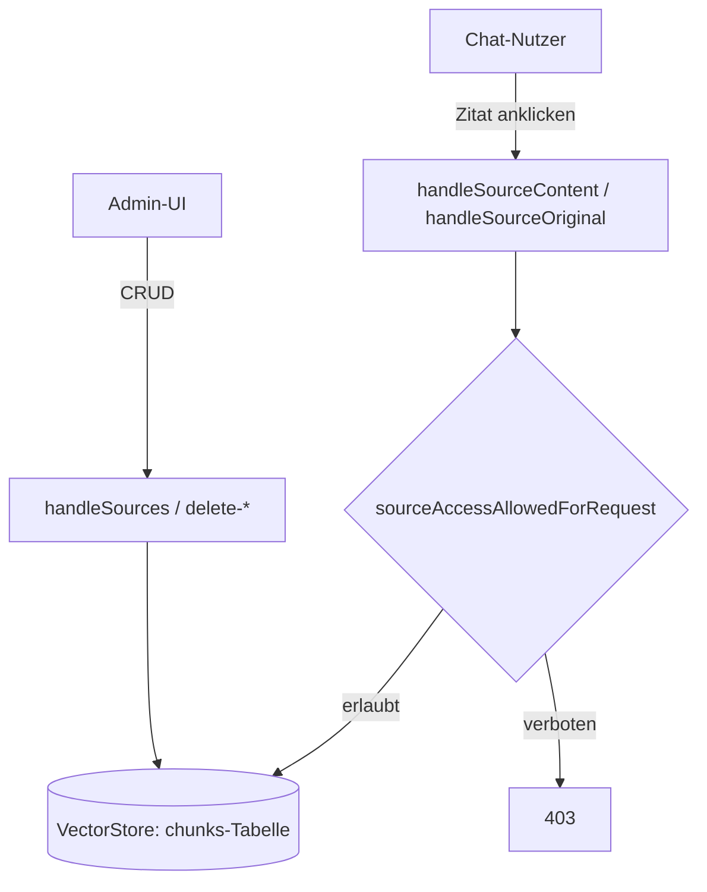

# Quellen- & Chunk-Verwaltung (`/api/sources*`, `/api/chunks`)

**Verbindungsrolle:** Server
**Datenfluss:** gemischt – Lese-Routen (`GET /api/sources`, `/content`, `/original`, `/chunks`) sind Pull, Schreib-/Lösch-Routen sind Push
**Schutz:** überwiegend `requireAdminSession`, zwei Ausnahmen (siehe unten)
**Registrierung:** [handlers.go:155-167](../handlers.go), [handlers.go:186](../handlers.go)

## Endpunkte

| Methode | Pfad | Schutz | Zweck |
|---|---|---|---|
| GET/POST | `/api/sources` | Admin | Quellenliste anzeigen/aktualisieren |
| POST | `/api/sources/delete` | Admin | Einzelne Quelle löschen |
| POST | `/api/sources/delete-by-kind` | Admin | Alle Quellen eines Typs löschen (z. B. „pst“) |
| POST | `/api/sources/delete-by-prefix` | Admin | Quellen nach Pfad-/Namenspräfix löschen |
| POST | `/api/sources/delete-by-filter` | Admin | Quellen nach beliebigem Filterkriterium löschen |
| GET | `/api/sources/content` | *ungegated*, aber `sourceAccessAllowedForRequest` | Aufbereiteten Text einer Quelle anzeigen |
| GET | `/api/sources/original` | *ungegated*, aber Zugriffsprüfung | Originaldatei/-inhalt herunterladen |
| GET/POST | `/api/chunks` | Admin | Einzelne Chunks einsehen/bearbeiten |

## Zugriffskontrolle bei Quelleninhalten

`handleSourceContent`/`handleSourceOriginal` ([handlers.go:166-167](../handlers.go))
sind bewusst nicht hinter `requireAdminSession`, da normale Nutzer im Chat auf
zitierte Quellen zugreifen dürfen müssen. Stattdessen prüft
`sourceAccessAllowedForRequest` gegen `settings.SourceAccess`
([settings.go:324](../settings.go)) pro Abteilung/Nutzer – siehe
[department-rules.md](department-rules.md).

## Ablauf

## Zusammenhänge

- Gemeinsamer Speicher mit Retrieval: [storage-backend.md](storage-backend.md)
- Herkunft der Quellen: [import-connectors.md](import-connectors.md), [file-upload.md](file-upload.md)
