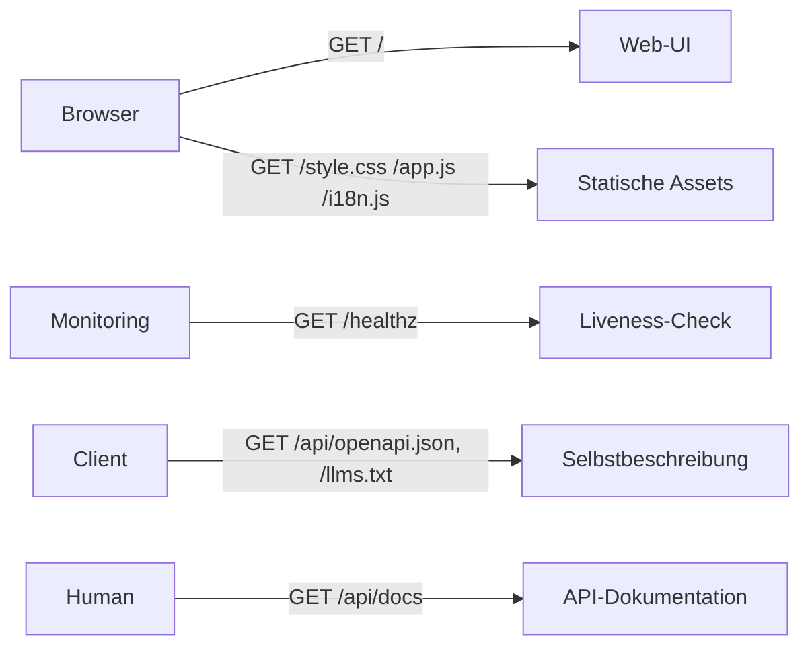

# Statische UI & Dokumentation

**Verbindungsrolle:** Server
**Datenfluss:** Pull (rein lesende GET-Auslieferung statischer Inhalte)
**Registrierung:** [handlers.go:48-116](../handlers.go)

## Technische Details (gelten für den gesamten Haupt-HTTP-Server)

- **Protokoll:** HTTP/1.1, reines `http.ListenAndServe` – **kein TLS im Prozess selbst**
  (TLS-Terminierung muss extern erfolgen, z. B. Reverse-Proxy)
- **Adresse/Port:** `-addr`-Flag, Default `:8090` ([main.go:93,249](../main.go))
- **Timeouts:** kein `ReadTimeout`/`WriteTimeout`/`ReadHeaderTimeout` gesetzt (Stdlib-Default = kein Timeout)
- **CORS:** keine CORS-Header konfiguriert
- **Rate-Limiting:** Login-Bruteforce-Schutz 10 Versuche/5 Min pro Client-IP
  (`RemoteAddr`, kein `X-Forwarded-For`-Trust) – [ratelimit.go:22-24](../ratelimit.go);
  optionaler Sliding-Window-Limiter je API-Key für `/api/ask` ([ratelimit.go:98-128](../ratelimit.go)), **standardmäßig deaktiviert**
- **Request-Größenlimits:** Datei-Upload 200 MB ([handlers_import_files.go:19](../handlers_import_files.go)), PST-Import 2 GB ([handlers_import_pst.go:17](../handlers_import_pst.go))

## Endpunkte

| Pfad | Zweck |
|---|---|
| `GET /` | Web-UI, zusammengesetzt aus `web/templates/*.html` ([main.go:36-56](../main.go)) |
| `GET /style.css` | eingebettetes Stylesheet |
| `GET /app.js` | eingebettetes Frontend-JS |
| `GET /i18n.js` | Übersetzungen fürs Frontend |
| `GET /healthz` | Liveness-Probe, Antwort `{"status":"ok"}` |
| `GET /api/openapi.json` | eingebettete OpenAPI-Spezifikation (`docs/openapi.json`) |
| `GET /llms.txt` | eingebettete `llms.txt` (LLM-lesbare Tool-Beschreibung) |
| `GET /api/docs` | Swagger-artiger API-Viewer (`web/apidocs.html`) |
| `GET /apidocs.js` | JS für den API-Viewer |
| `GET /openai-api` | Hinweisseite zur OpenAI-kompatiblen API (`web/openai-api.html`) |

## Zweck

Rein statisch/informativ – liefert das eingebettete Frontend sowie
Selbstbeschreibung des Tools (OpenAPI, `llms.txt`) für Menschen und
KI-Clients, ohne Geschäftslogik.

## Zusammenhänge

- `/api/openapi.json` beschreibt alle anderen in diesem Ordner dokumentierten Endpunkte
