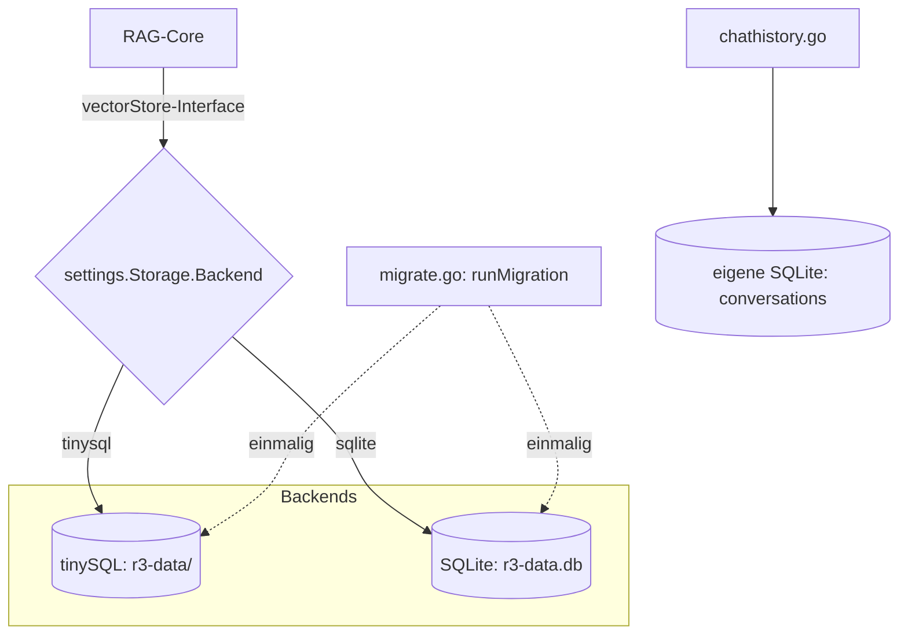

# Storage-Backend (Vektor-Store & Chat-Historie)

**Verbindungsrolle:** n/a – kein Netzwerk, reiner In-Process-/Dateizugriff (kein Client/Server-Modell anwendbar)
**Datenfluss:** Push (Schreiben neuer Chunks) bzw. Pull (Lesen bei Retrieval)
**Implementierung:** [vectorstore.go](../vectorstore.go), `vectorstore_tinysql.go`, `vectorstore_sqlite.go`

## Zweck

Persistiert alle importierten/hochgeladenen Inhalte als durchsuchbare Chunks
(Text + Embedding-Vektor) sowie die Chat-Historie. Zwei austauschbare Backends
hinter einem gemeinsamen `vectorStore`-Interface ([vectorstore.go:24](../vectorstore.go),
Konstruktion via `newVectorStore`, [vectorstore.go:219](../vectorstore.go)).

## Backends

| Backend | Bibliothek | Datei/Ordner | Tabellen |
|---|---|---|---|
| tinySQL (Standard) | `github.com/SimonWaldherr/tinySQL v0.21.1` | `r3-data/` (Ordner, Modi memory/wal/disk/index/hybrid) | `chunks`, `loads` ([vectorstore_tinysql.go:200-207](../vectorstore_tinysql.go)); geöffnet via `tinysql.OpenDB` ([vectorstore_tinysql.go:146](../vectorstore_tinysql.go)); eigene `VEC_SEARCH`/`FTS_SEARCH`/HNSW-Unterstützung |
| SQLite | `modernc.org/sqlite` | `r3-data.db` (Einzeldatei) | `chunks` ([vectorstore_sqlite.go:68](../vectorstore_sqlite.go)); `sql.Open("sqlite", path+"?_pragma=journal_mode(WAL)…")` ([vectorstore_sqlite.go:51](../vectorstore_sqlite.go)) |

Wahl über CLI-Flag `-storage-backend` bzw. `settings.Storage.Backend`;
Pfad via `-storage-path`.

## Technische Details

- **Kein Netzwerkprotokoll** – beide Backends laufen rein in-process/dateibasiert
- **tinySQL:** Speicher-Obergrenze via `-storage-max-mem-mb` (Default 256 MB,
  nur relevant für Modi `index`/`hybrid`)
- **SQLite:** geöffnet mit Pragmas `journal_mode(WAL)` und `busy_timeout=5000`ms
  ([vectorstore_sqlite.go:51](../vectorstore_sqlite.go))

**Separate SQLite-Datenbank für die Chat-Historie**: `chathistory.go:46`,
Tabelle `conversations` – siehe [chat-history.md](chat-history.md).

## Migration zwischen Backends

`migrate.go`, `runMigration` – einmaliger Lauf über `-migrate-from-backend`/
`-migrate-from-path`/`-migrate-from-mode` (Prozess beendet sich danach).

## Zusammenhänge

- Genutzt von praktisch allen Lese-/Schreibpfaden: [chat-ask.md](chat-ask.md),
  [search.md](search.md), [sources-chunks.md](sources-chunks.md),
  [file-upload.md](file-upload.md), [import-connectors.md](import-connectors.md)
- Statistiken: [storage-stats.md](storage-stats.md)
