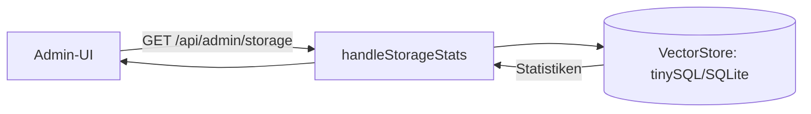

# Speicher-Statistiken (`/api/admin/storage`)

**Verbindungsrolle:** Server
**Datenfluss:** Pull
**Schutz:** `requireAdminSession`
**Registrierung:** [handlers.go:125](../handlers.go)
**Implementierung:** `handleStorageStats`, `handlers_storage.go`

## Zweck

Liefert Kennzahlen zum aktuellen Speicherverbrauch/-zustand des Vektor-Stores
(Anzahl Chunks, Quellen, Speichergröße, Backend-Modus) für das Admin-Dashboard.

Enthält bei tinySQL im `index`-/`hybrid`-Modus zusätzlich Vektor-Cache-
Kennzahlen (Trefferquote, Load-/Eviction-Zähler, Speicher- vs.
Festplatten-Footprint, ein "überladen/thrashing"-Flag) – dieselben Werte,
die auch das Storage-Einstellungen-Panel im Admin-UI anzeigt, siehe
[storage-backend.md](storage-backend.md).

## Zusammenhänge

- Bezieht sich auf das Backend aus [storage-backend.md](storage-backend.md)
