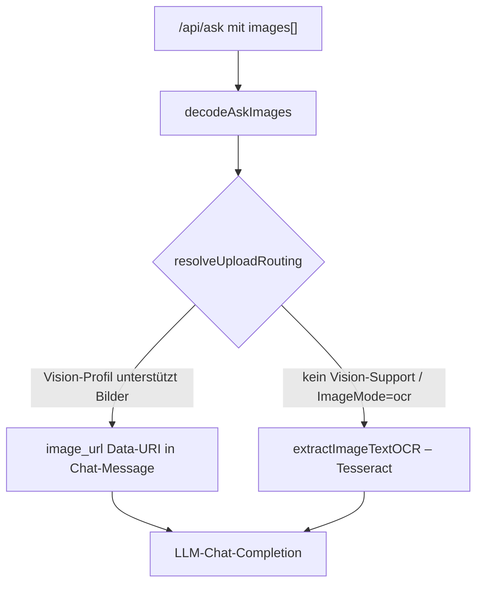

# Bild-Anhänge im Chat (Vision/OCR-Routing)

**Verbindungsrolle:** Server (Teil derselben Verbindung wie `/api/ask`, kein eigener Endpunkt)
**Datenfluss:** Push (Bilddaten werden in die Anfrage hineingeschrieben)
**Implementierung:** [chatimages.go](../chatimages.go)

## Zweck

Ermöglicht das Anhängen von Bildern an eine Chat-Frage. Je nach Konfiguration
werden Bilder entweder direkt an ein Vision-fähiges LLM weitergereicht oder
per OCR in Text umgewandelt, bevor die eigentliche RAG-Anfrage läuft.

## Limits

- max. **4 Anhänge** pro Anfrage (`askImageMaxCount`, hart codiert, kein
  Admin-Setting), max. **`Upload.MaxAttachmentMB` je Datei**
  (`effectiveMaxAttachmentMB`, [chatimages.go:139](../chatimages.go)) –
  Default **8 MB**, admin-konfigurierbar im Bereich **1–50 MB**
  (`attachmentMaxMB{Default,Min,Max}`, [chatimages.go:115-119](../chatimages.go));
  ein `settings.json` von vor diesem Feld verhält sich unverändert (Default
  greift bei `0`/nicht gesetzt)
- Die Frage selbst ist zusätzlich auf `Upload.MaxPromptChars` begrenzt –
  Default **20 000 Zeichen**, admin-konfigurierbar **2 000–100 000**
  (`promptMaxChars{Default,Min,Max}`, [chatimages.go:128-132](../chatimages.go)) –
  ein Schutz gegen ein versehentlich (oder absichtlich) riesiges Paste als
  Frage, nicht gegen eine lange, aber sinnvolle Frage
- Bilder sind **nicht persistent** – sie wirken nur auf die eine `/api/ask`-Antwort
  und werden nicht im Vektor-Store gespeichert.
- Ein Anhang muss entweder als Bild (`image/*`-MIME) oder als bereits von
  Import unterstütztes Dokumentformat (PDF, Office, Text, …) erkennbar sein
  (`isExtractableDocument`, `extract.go`) – alles andere wird mit 400
  abgelehnt.

## Downscaling vor dem Vision-Aufruf

Bevor ein Bild als `image_url`-Content-Part an ein Vision-Modell geht, wird
es per `downscaleForVision` ([chatimages.go:277](../chatimages.go)) verkleinert
und als JPEG re-encodiert – zwei admin-konfigurierbare Stellschrauben
(Settings → LLM-Backends & Routing):

- `Upload.VisionMaxDim` – längste Kantenlänge in Pixeln, Default **1600**,
  Bereich **800–1600** (`visionMaxDim{Default,Min,Max}`)
- `Upload.VisionJPEGQuality` – JPEG-Qualität, Default **85**, Bereich
  **50–95** (`visionJPEGQuality{Default,Min,Max}`)

Nicht dekodierbare Formate (z. B. WebP/BMP, stdlibs `image`-Paket kennt sie
nicht) werden unverändert durchgereicht statt das Upload zu blockieren.

## Mehrere Bilder & Dokumente in einer Anfrage

`buildUserMessage` ([chatimages.go:351](../chatimages.go)) trennt Anhänge in
Dokumente (immer textextrahiert, nie als Vision-Bild gesendet – auch ein
vision-fähiges Modell "sieht" ein PDF nicht sinnvoll als Bild) und
tatsächliche Bilder. Bei **mehr als einem** Bild wird jedem Bild eine
Dateiname-Beschriftung vorangestellt (`labelImages`,
[chatimages.go:397](../chatimages.go)), damit das Modell in der Antwort
gezielt auf "das zweite Bild" verweisen kann – bei genau einem Anhang
entfällt das als unnötiges Rauschen.

**Hybrid-Routing:** Ist das Vision-Backend nicht verfügbar/nicht konfiguriert
(oder `ImageMode="ocr"`), werden auch mehrere Bilder alle per OCR
(`extractImageTextOCR`, Tesseract) in Klartext umgewandelt und zusammen mit
etwaigem Dokumenttext vor die eigentliche Frage gestellt – ein
Fehlschlag bei einem einzelnen Bild/Dokument (Tesseract/markitdown fehlt,
`AllowShellExec` aus, kein erkennbarer Inhalt) degradiert zu einer Warnung
statt die ganze Anfrage scheitern zu lassen; die übrigen Anhänge werden
trotzdem verarbeitet.

## Kernfunktionen

| Funktion | Zeile | Zweck |
|---|---|---|
| `resolveUploadRouting` | [chatimages.go:76](../chatimages.go) | entscheidet Vision vs. OCR anhand `settings.Upload.ImageMode` und `VisionProfile` |
| `decodeAskImages` | [chatimages.go:185](../chatimages.go) | Base64-Decodierung/-Validierung/Größenlimit der `askRequest.Images`, Bild- vs. Dokument-Erkennung |
| `downscaleForVision` | [chatimages.go:277](../chatimages.go) | verkleinert/re-encodiert ein Bild vor dem Vision-Aufruf |
| `buildUserMessage` | [chatimages.go:351](../chatimages.go) | baut Vision-Content-Parts (`image_url`, Data-URI, ggf. mit Bild-Beschriftung), OCR-Text (Tesseract, `extract.go`) und/oder extrahierten Dokumenttext |

## Ablauf

## Zusammenhänge

- Eingebettet in [chat-ask.md](chat-ask.md)
- Vision-fähiger LLM-Aufruf: [llm-embedding-provider.md](llm-embedding-provider.md)
- Teilt Base64-Anhang-Konvention mit Mail-Attachments: [mail-draft-workflow.md](mail-draft-workflow.md)
